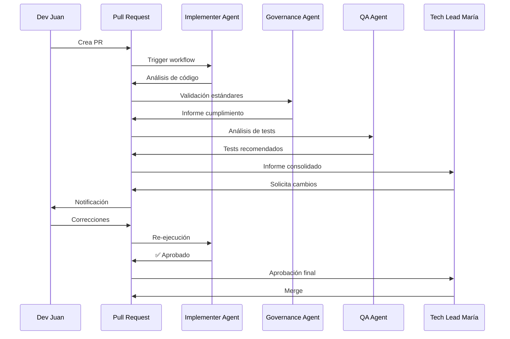

# Ejemplo: Revisión de Código .NET

> **ID:** `examples/dotnet-review`
> **Descripción:** Ejemplo completo de revisión de código .NET usando el workflow Code Review Asistido
> **Estado:** draft

---

## Escenario

**Sistema:** APB.GestionFacturas (módulo legacy en proceso de modernización)
**Pull Request:** #247 — "Añadir validación de NIF en servicio de clientes"
**Agentes involucrados:** Implementer Agent, Governance Agent, QA Automation Agent
**Workflow:** `apb-wf-code-review-v1.0`

---

## Paso 1: Invocación del Workflow

```
Invocar: apb-wf-code-review-v1.0
Input: {
  repository: "APB/GestionFacturas",
  pr_number: 247,
  pr_title: "Añadir validación de NIF en servicio de clientes",
  changed_files: [
    "src/Services/Clientes/Validadores/NifValidator.cs",
    "src/Services/Clientes/Servicios/ClienteService.cs",
    "tests/Services/Clientes/Validadores/NifValidatorTests.cs"
  ],
  author: "dev-juan.garcia",
  reviewer: "tech-lead-maria.lopez"
}
```

---

## Paso 2: Análisis del Implementer Agent

### 2.1 Skill Invocada: `apb-dev-code-review-v1.0`

**Input:**
```
Código fuente de NifValidator.cs:
```csharp
public class NifValidator : INifValidator
{
    public bool Validar(string nif)
    {
        if (string.IsNullOrEmpty(nif)) return false;
        if (nif.Length != 9) return false;

        var letras = "TRWAGMYFPDXBNJZSQVHLCKE";
        var numero = nif.Substring(0, 8);
        var letra = nif.Substring(8, 1);

        if (!int.TryParse(numero, out int num)) return false;

        var resto = num % 23;
        return letras[resto].ToString() == letra.ToUpper();
    }
}
```

**Análisis del Agente:**

| Aspecto | Evaluación | Comentario |
|---------|-----------|------------|
| **Correctitud funcional** | ✅ Correcto | Algoritmo de validación de DNI español implementado correctamente |
| **Manejo de null/empty** | ✅ Correcto | Valida `string.IsNullOrEmpty` al inicio |
| **Validación de longitud** | ✅ Correcto | Verifica longitud exacta de 9 caracteres |
| **Extracción de letras** | ⚠️ Mejorable | `letras` como string literal — mejor como constante |
| **Cobertura de casos** | ⚠️ Mejorable | No valida NIE (X,Y,Z prefijo) ni CIF |
| **Naming** | ⚠️ Mejorable | `numero` y `num` son ambiguos; `letra` podría ser `letraCalculada` |
| **Logging** | ❌ Ausente | Sin logging de validaciones fallidas |
| **Excepciones** | ⚠️ Mejorable | `int.TryParse` maneja excepciones silenciosamente — ¿es intencional? |

### 2.2 Recomendaciones Generadas

```markdown
## Recomendaciones de Revisión (PR #247)

### 🔴 Bloqueantes
1. **Falta de soporte NIE:** El validador solo soporta DNI. Para clientes extranjeros se requiere NIE (formato X1234567L, Y1234567L, Z1234567L). Añadir según requisito RF-042.

### 🟡 Mejorables
2. **Constante para letras:** Extraer `"TRWAGMYFPDXBNJZSQVHLCKE"` como constante de clase.
3. **Logging:** Añadir logging de validaciones fallidas para trazabilidad.
4. **Tests negativos:** Añadir tests para NIFs inválidos (letra incorrecta, formato erróneo).

### 🟢 Positivo
5. **Cobertura de tests:** Los tests unitarios cubren el 85% del validador. Buen trabajo.
```

---

## Paso 3: Validación del Governance Agent

### 3.1 Skill Invocada: `apb-gov-standards-v1.0`

**Análisis de Cumplimiento:**

| Estándar | Estado | Detalle |
|----------|--------|---------|
| **Nomenclatura de clases** | ✅ Cumple | `NifValidator` sigue patrón `{Entidad}Validator` |
| **Interfaces** | ✅ Cumple | Implementa `INifValidator` |
| **Inyección de dependencias** | ⚠️ Parcial | No se observa constructor con DI en el snippet |
| **Logging (Serilog)** | ❌ No cumple | Estándar APB-LOG-001 requiere ILogger |
| **Manejo de excepciones** | ⚠️ Parcial | Silenciamiento de errores debe documentarse |
| **Documentación XML** | ❌ No cumple | Métodos públicos requieren `<summary>` |

### 3.2 Informe de Cumplimiento

```markdown
## Informe de Cumplimiento — PR #247

**Estado:** ❌ NO CUMPLE (2 estándares incumplidos)

**Incumplimientos:**
1. **APB-LOG-001:** Falta ILogger<NifValidator> para trazabilidad
2. **APB-DOC-001:** Método `Validar` sin documentación XML

**Recomendación:** Corregir incumplimientos antes de merge.
```

---

## Paso 4: Análisis de QA Automation Agent

### 4.1 Skill Invocada: `apb-qa-unit-test-gen-v1.0`

**Análisis de Tests:**

```csharp
// Tests existentes (proporcionados en PR)
public class NifValidatorTests
{
    private readonly NifValidator _validator = new();

    [Theory]
    [InlineData("12345678Z", true)]
    [InlineData("12345678A", false)]
    [InlineData("", false)]
    [InlineData(null, false)]
    public void Validar_Dni_ReturnsExpected(string nif, bool expected)
    {
        var result = _validator.Validar(nif);
        Assert.Equal(expected, result);
    }
}
```

| Aspecto | Evaluación | Cobertura |
|---------|-----------|-----------|
| **Casos positivos** | ✅ 1 caso | DNI válido |
| **Casos negativos** | ⚠️ 2 casos | Necesita más casos edge |
| **Null/empty** | ✅ Cubierto | `null` y `""` |
| **NIE** | ❌ No cubierto | Requerido por RF-042 |
| **CIF** | ❌ No cubierto | Fuera de scope actual |
| **Cobertura total** | 85% | Objetivo: ≥ 80% ✅ |

### 4.2 Tests Recomendados (Generados)

```csharp
[Theory]
[InlineData("X1234567L", true)]   // NIE tipo X
[InlineData("Y1234567X", true)]   // NIE tipo Y  
[InlineData("Z1234567R", true)]   // NIE tipo Z
[InlineData("1234567", false)]    // Longitud incorrecta
[InlineData("123456789", false)]  // Longitud incorrecta
[InlineData("ABCDEFGHI", false)]  // Formato no numérico
[InlineData("12345678", false)]   // Sin letra
public void Validar_EdgeCases_ReturnsExpected(string nif, bool expected)
{
    var result = _validator.Validar(nif);
    Assert.Equal(expected, result);
}
```

---

## Paso 5: Resumen Consolidado del Workflow

### 5.1 Informe Final de Revisión

```markdown
# Informe de Revisión de Código — PR #247

**Fecha:** 2026-06-21
**Workflow:** apb-wf-code-review-v1.0
**Agentes:** Implementer, Governance, QA Automation

## Resumen Ejecutivo
| Métrica | Valor |
|---------|-------|
| Estado | ⚠️ REQUIERE CAMBIOS |
| Issues bloqueantes | 1 |
| Issues mejorables | 4 |
| Cumplimiento estándares | 60% (3/5) |
| Cobertura de tests | 85% |

## Decisiones Requeridas
1. **Soporte NIE:** ¿Se incluye en este PR o se crea ticket separado?
2. **Logging:** ¿Añadir ILogger o documentar intencionalidad del silenciamiento?

## Próximos Pasos
- [ ] Autor corrige issues bloqueantes
- [ ] Re-ejecutar workflow de revisión
- [ ] Aprobación por Tech Lead
- [ ] Merge a develop
```

### 5.2 Diagrama del Flujo



---

## Lecciones Aprendidas

1. **Validación de requisitos:** El agente detectó que el requisito RF-042 (soporte NIE) no estaba implementado, aunque estaba en el spec.
2. **Cobertura vs. calidad:** 85% de cobertura es bueno, pero los casos edge faltantes son críticos.
3. **Estándares de logging:** La falta de ILogger es un patrón recurrente en código legacy — considerar linter automático.

---
*Ejemplo generado por APB AI Framework — Sesión 5*
