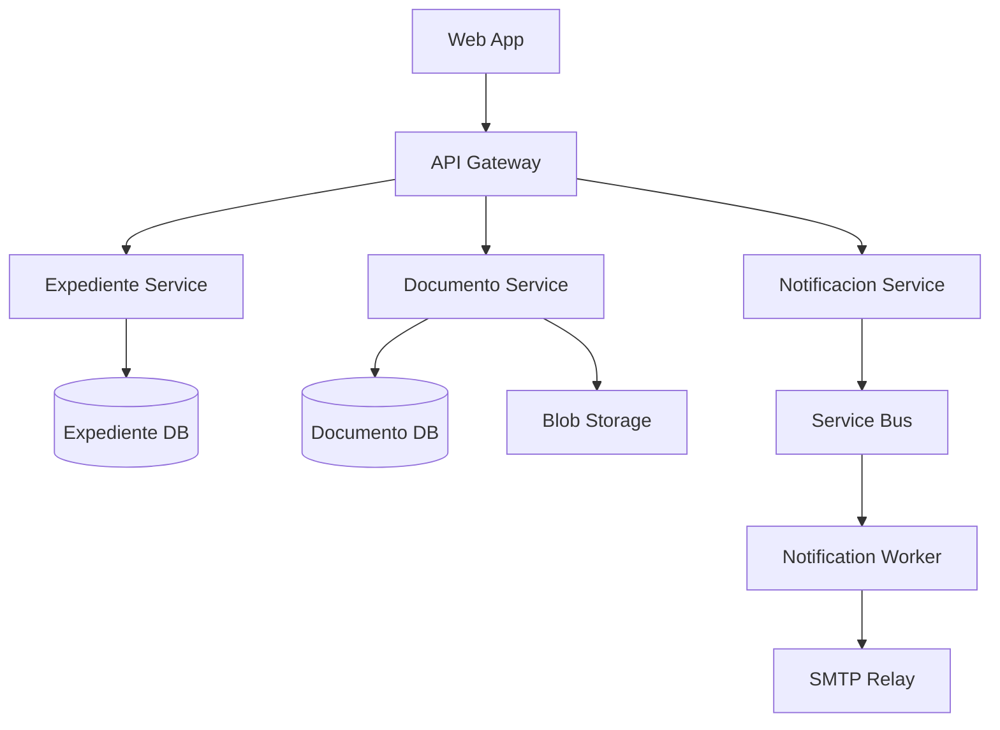
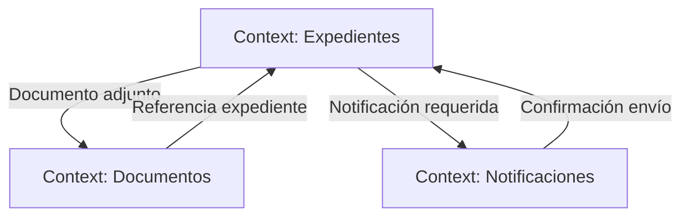

# Ejemplo: Generación de Spec desde Legacy

> **ID:** `examples/spec-generation`
> **Descripción:** Ejemplo completo de generación de system-spec.md desde código legacy
> **Estado:** draft

---

## Escenario

**Sistema:** APB.GestionExpedientes (monolito ASP.NET Web Forms, 2008)
**Objetivo:** Generar system-spec.md para onboarding al framework SDD
**Agentes involucrados:** Modernization Architect, Spec Engineer, Domain Architect
**Workflow:** `apb-wf-spec-from-legacy-v1.0`
**Skills:** `apb-disc-spec-gen-v1.0`, `third-openspec-spec-gen-v1.0`, `wrap-openspec-v1.0`

---

## Paso 1: Preparación del Repositorio

```bash
# Clonar repo legacy
git clone https://github.com/APB/GestionExpedientes.git
cd GestionExpedientes

# Ejecutar scaffold de onboarding
cp -r repo-scaffold/legacy-ready/ ./
./scripts/analyze-legacy.sh
```

---

## Paso 2: Discovery Inicial (Modernization Architect)

### 2.1 Skill: `apb-disc-reverse-code-v1.0`

**Input:**
```
Repository: APB/GestionExpedientes
Technology: ASP.NET Web Forms, .NET Framework 4.8
Database: SQL Server 2016
```

**Análisis Generado:**

```markdown
# Análisis de Código Legacy — GestionExpedientes

## Estructura del Proyecto
```
GestionExpedientes/
├── App_Code/
│   ├── Business/
│   │   ├── ExpedienteManager.cs      # 2,340 líneas
│   │   ├── DocumentoManager.cs       # 1,890 líneas
│   │   └── NotificacionManager.cs    # 1,560 líneas
│   ├── DataAccess/
│   │   ├── ExpedienteDAL.cs          # 3,100 líneas
│   │   └── DocumentoDAL.cs           # 2,450 líneas
│   └── Entities/
│       ├── Expediente.cs
│       ├── Documento.cs
│       └── Notificacion.cs
├── Pages/
│   ├── Expedientes/
│   │   ├── Listado.aspx
│   │   ├── Detalle.aspx
│   │   └── Edicion.aspx
│   └── Documentos/
│       └── Gestion.aspx
└── Web.config
```

## Métricas de Complejidad
| Módulo | Líneas | Métodos | Complejidad Ciclomática | Dependencias |
|--------|--------|---------|------------------------|-------------|
| ExpedienteManager | 2,340 | 47 | 89 (Alto) | 12 |
| DocumentoManager | 1,890 | 38 | 67 (Alto) | 8 |
| NotificacionManager | 1,560 | 29 | 45 (Medio) | 6 |
| ExpedienteDAL | 3,100 | 62 | 112 (Muy Alto) | 4 |

## Patrones Detectados
| Patrón | Frecuencia | Impacto |
|--------|-----------|---------|
| God Class | 3 | 🔴 Alto |
| SQL Embebido | 45 queries | 🔴 Alto |
| Código Duplicado | 23 bloques | 🟡 Medio |
| Magic Strings | 67 ocurrencias | 🟡 Medio |
| Sin Inyección de Dependencias | 100% | 🔴 Alto |

## Dependencias Externas
| Sistema | Tipo | Frecuencia |
|---------|------|------------|
| Active Directory | Autenticación | Cada request |
| Servicio Correo SMTP | Notificaciones | Alta |
| File Server (\s01) | Documentos | Alta |
| SQL Server PROD | Datos | Cada request |
```

---

## Paso 3: Generación de Spec (Spec Engineer)

### 3.1 Skill: `third-openspec-spec-gen-v1.0`

**Input:**
```
source_code_path: "/repos/GestionExpedientes"
existing_docs: ["docs/legacy/ManualUsuario.pdf", "docs/legacy/DiagramaER.png"]
output_format: "APB"
```

**Output Raw (OpenSpec):**
```markdown
# System Specification — GestionExpedientes

## Entities
- Expediente: id, numero, tipo, estado, fechaCreacion, fechaCierre
- Documento: id, expedienteId, nombre, rutaFisica, fechaSubida
- Notificacion: id, expedienteId, tipo, destinatario, estadoEnvio

## Business Logic
- ExpedienteManager: CRUD + workflow de estados
- DocumentoManager: Gestión de archivos + validación
- NotificacionManager: Envío de correos + tracking

## Data Access
- ExpedienteDAL: Stored procedures directos
- DocumentoDAL: Queries parametrizadas
```

### 3.2 Aplicación del Wrapper: `wrap-openspec-v1.0`

**Output Adaptado (Formato APB):**

```markdown
# System Specification — GestionExpedientes

> **Proyecto:** APB.GestionExpedientes
> **Versión:** 1.0.0-draft (generado desde legacy)
> **Fecha:** 2026-06-21
> **Autor:** APB AI Framework — Modernization Architect + Spec Engineer
> **Origen:** Código legacy ASP.NET Web Forms (.NET Framework 4.8)
> **Estado ENS:** Pendiente de evaluación

---

## 1. Alcance

### 1.1 Objetivo
Sistema de gestión de expedientes administrativos que permite la creación, seguimiento, documentación y notificación de trámites internos.

### 1.2 Contexto de Negocio
El sistema gestiona el ciclo de vida completo de expedientes administrativos, desde su creación hasta su cierre, incluyendo la gestión documental asociada y las notificaciones a interesados.

### 1.3 Stakeholders
| Rol | Responsabilidad |
|-----|-----------------|
| Gestor de Expedientes | Creación y seguimiento de trámites |
| Administrador | Configuración y reportes |
| Interesado | Recepción de notificaciones |

## 2. Requisitos Funcionales

### 2.1 Épicas
| ID | Épica | Prioridad |
|----|-------|-----------|
| EP-001 | Gestión de Expedientes | Alta |
| EP-002 | Gestión Documental | Alta |
| EP-003 | Notificaciones | Media |

### 2.2 User Stories (Extraídas desde código)
| ID | Historia | Criterios de Aceptación | Épica |
|----|----------|------------------------|-------|
| US-001 | Como gestor, quiero crear un expediente para iniciar un trámite | Validación de campos obligatorios; Generación automática de número | EP-001 |
| US-002 | Como gestor, quiero cambiar el estado de un expediente para reflejar su avance | Estados: Borrador → EnTramite → Resuelto → Cerrado; Transiciones válidas | EP-001 |
| US-003 | Como gestor, quiero adjuntar documentos a un expediente para aportar evidencia | Tamaño máximo 50MB; Formatos: PDF, DOC, DOCX; Virus scan | EP-002 |
| US-004 | Como sistema, quiero enviar notificaciones por correo para informar a interesados | SMTP corporativo; Plantilla configurable; Registro de envío | EP-003 |

## 3. Arquitectura

### 3.1 Diagrama de Componentes (Recomendado)


### 3.2 Stack Tecnológico Objetivo
| Capa | Legacy | Objetivo |
|------|--------|----------|
| Frontend | ASP.NET Web Forms | DevExtreme JS + API REST |
| Backend | .NET Framework 4.8 | .NET 8 |
| Base de datos | SQL Server 2016 | Azure SQL / PostgreSQL |
| Archivos | File Server | Azure Blob Storage |
| Mensajería | Síncrona (SMTP directo) | Azure Service Bus |
| Autenticación | Active Directory | Azure AD |

### 3.3 Bounded Contexts Identificados
| Contexto | Descripción | Complejidad | Prioridad de Extracción |
|----------|-------------|-------------|------------------------|
| Expedientes | Gestión del ciclo de vida de trámites | Alta | Alta |
| Documentos | Gestión documental y archivos | Media | Media |
| Notificaciones | Envío y tracking de comunicaciones | Baja | Alta (desacoplamiento) |

### 3.4 Mapa de Contextos


## 4. API Design

### 4.1 Contratos Propuestos
```yaml
# Expediente API
POST /api/v1/expedientes
GET /api/v1/expedientes/{id}
PUT /api/v1/expedientes/{id}/estado
GET /api/v1/expedientes/{id}/documentos

# Documento API
POST /api/v1/documentos
GET /api/v1/documentos/{id}
DELETE /api/v1/documentos/{id}

# Notificacion API
POST /api/v1/notificaciones
GET /api/v1/notificaciones/{id}/estado
```

### 4.2 Eventos de Dominio
| Evento | Productor | Consumidor | Schema |
|--------|-----------|------------|--------|
| ExpedienteCreado | Expediente Service | Notificación Service | CloudEvents |
| EstadoExpedienteCambiado | Expediente Service | Audit Service | CloudEvents |
| DocumentoSubido | Documento Service | Expediente Service | CloudEvents |
| NotificacionEnviada | Notificación Service | Expediente Service | CloudEvents |

## 5. Calidad

### 5.1 Testing
- Cobertura mínima objetivo: 80%
- Tests de caracterización: Generar desde comportamiento actual
- Tests E2E: Flujos críticos (crear expediente → adjuntar doc → notificar)

### 5.2 Observabilidad
- Métricas: Application Insights
- Logs: Serilog (reemplazar System.Diagnostics.Trace)
- Tracing: OpenTelemetry

### 5.3 SLOs Propuestos
| Indicador | Objetivo | Justificación |
|-----------|----------|---------------|
| Availability | 99.5% | Sistema interno, no crítico 24/7 |
| Latency p95 | < 2s | Legacy actual ~3s, mejora objetivo |
| Error Rate | < 1% | Sistema administrativo |

## 6. Seguridad

### 6.1 Threat Model (Preliminar)
| Amenaza | Componente | Mitigación |
|---------|-----------|------------|
| Inyección SQL | ExpedienteDAL | Parametrización + ORM |
| Path Traversal | DocumentoManager | Validación de rutas + Blob Storage |
| Exposición datos | NotificacionManager | Anonimización logs |

### 6.2 Controles ENS
| Control | Implementación Legacy | Implementación Objetivo |
|---------|----------------------|------------------------|
| Acceso controlado | AD Windows | Azure AD + RBAC |
| Cifrado en tránsito | SSL (configurado) | TLS 1.3 |
| Cifrado en reposo | No | Azure SQL TDE + Blob encryption |
| Auditoría | Logs locales | Application Insights + Log Analytics |

## 7. Despliegue

### 7.1 Estrategia de Modernización
**Estrategia:** Strangler Fig Pattern

| Fase | Componente | Duración Est. |
|------|-----------|--------------|
| 1 | Notificación Service (desacoplamiento) | 4 semanas |
| 2 | Documento Service (extracción) | 6 semanas |
| 3 | Expediente Service (extracción core) | 8 semanas |
| 4 | Frontend moderno | 6 semanas |
| 5 | Retirada Web Forms | 2 semanas |

### 7.2 Entornos
| Entorno | Infraestructura | Propósito |
|---------|----------------|-----------|
| Dev | Azure Container Apps | Desarrollo |
| Staging | Azure App Service | Validación con datos anonimizados |
| Prod | Azure App Service | Producción (migración gradual) |

## 8. Gobierno

### 8.1 ADRs Generados
| ID | Decisión | Contexto |
|----|----------|----------|
| ADR-001 | Strangler Fig vs. Big Bang | Riesgo de downtime en Big Bang |
| ADR-002 | Azure SQL vs. PostgreSQL | Compatibilidad con equipo actual |
| ADR-003 | Service Bus vs. RabbitMQ | Ecosistema Azure corporativo |

### 8.2 Evidencias de Onboarding
| Tipo | Ubicación | Fecha |
|------|-----------|-------|
| Discovery de código | docs/discovery/ | 2026-06-21 |
| Análisis DDD | docs/discovery/ddd-analysis.md | 2026-06-21 |
| Spec generado | docs/system-spec.md | 2026-06-21 |
| Plan de modernización | docs/modernization/ | 2026-06-21 |

## 9. Riesgos y Dependencias

### 9.1 Riesgos
| Riesgo | Probabilidad | Impacto | Mitigación |
|--------|-------------|---------|------------|
| Pérdida de conocimiento business | Alta | Alto | Entrevistas con usuarios clave |
| Datos sensibles en logs legacy | Media | Alto | Anonimización previa a análisis |
| Dependencias no documentadas | Alta | Medio | Análisis de red + entrevistas |

### 9.2 Dependencias
| Dependencia | Tipo | Estado |
|-------------|------|--------|
| Active Directory | Autenticación | Migración a Azure AD en curso |
| Servidor SMTP | Notificaciones | Reemplazo por Azure Communication Services |
| File Server | Almacenamiento | Migración a Blob Storage |

---
*Generado automáticamente desde código legacy — APB AI Framework*
*Requiere validación humana antes de aprobación*
```

---

## Paso 4: Validación por Domain Architect

### 4.1 Skill: `apb-arch-validate-v1.0`

**Validación de la Spec Generada:**

| Aspecto | Estado | Comentario |
|---------|--------|------------|
| **Completitud de dominios** | ✅ | 3 bounded contexts identificados |
| **Consistencia con código** | ✅ | User stories mapeadas a métodos existentes |
| **Viabilidad técnica** | ⚠️ | Fase 3 (Expediente Service) puede requerir más tiempo |
| **Cumplimiento ENS** | ⚠️ | Controles preliminares, requiere análisis formal |
| **Stack tecnológico** | ✅ | Alineado con estándares APB |

### 4.2 Ajustes Recomendados
1. **Añadir contexto de Auditoría:** El código legacy tiene tablas de auditoría no reflejadas en bounded contexts.
2. **Revisar priorización:** Notificación Service debería ser prioridad media, no alta — no es bloqueante para otros servicios.
3. **Añadir ADR de base de datos:** Justificar Azure SQL sobre PostgreSQL con datos de rendimiento legacy.

---

## Paso 5: Registro en Catálogo

```
Registro en CATALOG.md:
- Nuevo sistema: APB.GestionExpedientes
- Estado: draft (onboarding en progreso)
- Workflow activo: apb-wf-legacy-onboarding-v1.0
- Spec generado: docs/system-spec.md
- Próximo paso: Validación humana + ajustes
```

---

## Métricas del Ejemplo

| Métrica | Valor |
|---------|-------|
| Tiempo de generación | ~15 min (agente) + 2h (validación humana) |
| Cobertura de código analizado | 100% (3 managers + 2 DALs) |
| User stories extraídas | 4 (de 47 métodos analizados) |
| Bounded contexts identificados | 3 |
| ADRs generados | 3 |
| Issues de calidad detectados | 12 (5 críticos, 7 mejorables) |

---

## Lecciones Aprendidas

1. **Código sin tests:** La falta de tests unitarios dificultó la extracción de comportamiento esperado. Se recomienda generar tests de caracterización antes de la spec.
2. **SQL embebido:** 45 queries embebidas requieren análisis individual para diseño de repositorios.
3. **Documentación legacy:** El manual de usuario (PDF) proporcionó contexto de negocio que el código no revelaba.

---
*Ejemplo generado por APB AI Framework — Sesión 5*
