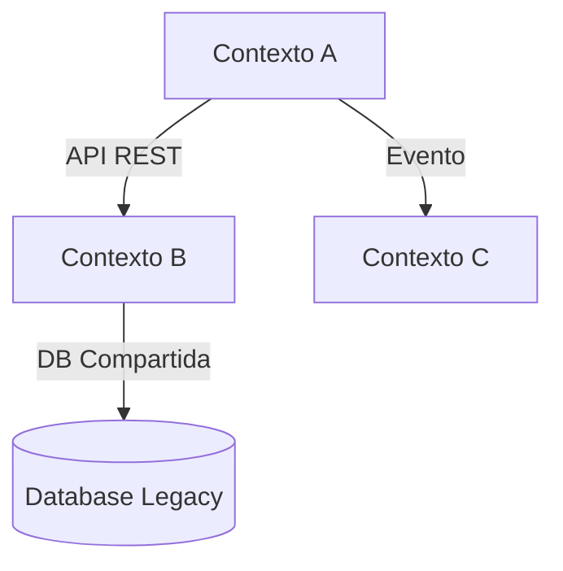

# Scaffold: Legacy-Ready

> **ID:** `repo-scaffold/legacy-ready`
> **Descripción:** Scaffold para repos legacy que se onboardan al framework APB
> **Estado:** draft

---

## Estructura del Scaffold

```
repo-legacy-ready/
├── .github/
│   ├── workflows/
│   │   ├── ci-legacy.yml
│   │   └── modernization-check.yml
│   └── PULL_REQUEST_TEMPLATE.md
├── docs/
│   ├── discovery/
│   │   ├── business-discovery.md
│   │   ├── technical-discovery.md
│   │   └── ddd-analysis.md
│   ├── modernization/
│   │   ├── modernization-plan.md
│   │   ├── migration-strategy.md
│   │   └── risk-assessment.md
│   ├── adr/
│   │   └── 001-legacy-context.md
│   └── runbooks/
│       ├── onboarding.md
│       └── rollback.md
├── src/
│   └── [código legacy existente]
├── tests/
│   ├── Unit/                    # Tests unitarios legacy
│   ├── Integration/             # Tests de integración
│   └── Characterization/        # Tests de caracterización
├── infrastructure/
│   ├── terraform/               # Infra nueva (si aplica)
│   └── docker/                  # Contenerización
├── scripts/
│   ├── analyze-legacy.sh        # Análisis automático
│   ├── generate-spec.sh         # Generación de spec desde código
│   └── modernization-check.sh   # Validación de modernización
├── .editorconfig
├── .gitignore
├── README.md
├── LEGACY_CONTEXT.md
└── MODERNIZATION_STATUS.md
```

## Archivos Incluidos

### LEGACY_CONTEXT.md
```markdown
# Contexto del Sistema Legacy

> **Sistema:** [Nombre del Sistema]
> **Tecnología:** [Stack legacy]
> **Año de origen:** [Año]
> **Estado:** En operación / En proceso de modernización
> **Fecha de onboarding:** [YYYY-MM-DD]

## 1. Descripción General

### 1.1 Propósito del Sistema
[Descripción del propósito original y actual]

### 1.2 Tecnologías Legacy
| Capa | Tecnología | Versión | Estado |
|------|-----------|---------|--------|
| Frontend | [Tecnología] | [Versión] | [Estado] |
| Backend | [Tecnología] | [Versión] | [Estado] |
| Base de datos | [Tecnología] | [Versión] | [Estado] |
| Infraestructura | [Tecnología] | [Versión] | [Estado] |

### 1.3 Dependencias Externas
| Sistema | Tipo | Frecuencia | Críticidad |
|---------|------|------------|------------|
| [Sistema] | [API/DB/File] | [Frecuencia] | [Alta/Media/Baja] |

## 2. Análisis de Deuda Técnica

### 2.1 Métricas de Calidad
| Métrica | Valor Actual | Umbral APB | Estado |
|---------|-------------|------------|--------|
| Cobertura de tests | [%] | ≥ 80% | [🔴/🟡/🟢] |
| Deuda técnica (Sonar) | [días] | < 30 días | [🔴/🟡/🟢] |
| Vulnerabilidades | [N] | 0 críticas | [🔴/🟡/🟢] |
| Code smells | [N] | < 100 | [🔴/🟡/🟢] |

### 2.2 Patrones Problemáticos
| Patrón | Ubicación | Impacto | Plan de Mitigación |
|--------|-----------|---------|-------------------|
| [Patrón] | [Archivo/Módulo] | [Alto/Medio/Bajo] | [Plan] |

## 3. Análisis DDD

### 3.1 Dominios Identificados
| Dominio | Descripción | Complejidad | Prioridad |
|---------|-------------|-------------|-----------|
| [Dominio] | [Descripción] | [Alta/Media/Baja] | [Alta/Media/Baja] |

### 3.2 Bounded Contexts
| Contexto | Dominio | Acoplamiento | Extracción Prioridad |
|----------|---------|-------------|---------------------|
| [Contexto] | [Dominio] | [Alto/Medio/Bajo] | [Alta/Media/Baja] |

### 3.3 Mapa de Contextos


## 4. Plan de Modernización

### 4.1 Estrategia
[Estrategia de modernización: Strangler Fig, Big Bang, Parallel, etc.]

### 4.2 Fases
| Fase | Objetivo | Duración Est. | Dependencias |
|------|----------|--------------|-------------|
| 1 | [Objetivo] | [X semanas] | [Dependencias] |
| 2 | [Objetivo] | [X semanas] | [Dependencias] |

### 4.3 Riesgos
| Riesgo | Probabilidad | Impacto | Mitigación |
|--------|-------------|---------|------------|
| [Riesgo] | [Alta/Media/Baja] | [Alto/Medio/Bajo] | [Mitigación] |

## 5. Testing de Caracterización

### 5.1 Tests Existentes
| Tipo | Cobertura | Estado |
|------|-----------|--------|
| Unitarios | [%] | [Estado] |
| Integración | [%] | [Estado] |

### 5.2 Tests de Caracterización Generados
| Módulo | Tests Generados | Cobertura |
|--------|----------------|-----------|
| [Módulo] | [N] | [%] |

## 6. Seguridad

### 6.1 Vulnerabilidades Conocidas
| CVE/Severidad | Componente | Estado |
|---------------|-----------|--------|
| [CVE] | [Componente] | [Pendiente/Mitigado] |

### 6.2 Controles ENS Legacy
| Control | Implementación | Cumplimiento |
|---------|----------------|-------------|
| [Control] | [Descripción] | [Sí/No/Parcial] |

## 7. Operaciones

### 7.1 Entornos
| Entorno | Infraestructura | Acceso |
|---------|----------------|--------|
| Producción | [Infra] | [Restringido] |
| Pre-producción | [Infra] | [Limitado] |

### 7.2 Procedimientos Críticos
| Procedimiento | Frecuencia | Documentación | RTO |
|---------------|------------|---------------|-----|
| [Backup] | [Frecuencia] | [Ubicación] | [RTO] |

## 8. Gobierno

### 8.1 ADRs Legacy
| ID | Decisión | Contexto | Estado |
|----|----------|----------|--------|
| ADR-001 | [Decisión] | [Contexto] | [Estado] |

### 8.2 Evidencias de Onboarding
| Tipo | Ubicación | Fecha | Responsable |
|------|-----------|-------|-------------|
| Discovery | docs/discovery/ | [Fecha] | [Agente/Equipo] |
| Modernización | docs/modernization/ | [Fecha] | [Agente/Equipo] |

---
*Generado desde scaffold Legacy-Ready — APB AI Framework*
```

### MODERNIZATION_STATUS.md
```markdown
# Estado de Modernización

> **Última actualización:** [YYYY-MM-DD]
> **Responsable:** [Equipo/Agente]

## Resumen
| Métrica | Valor |
|---------|-------|
| Fase actual | [Fase] |
| Progreso | [%] |
| Bloqueos | [N] |
| Riesgos activos | [N] |

## Fases
- [ ] Fase 1: Discovery y análisis
- [ ] Fase 2: Diseño de arquitectura objetivo
- [ ] Fase 3: Implementación de nuevo servicio
- [ ] Fase 4: Migración de datos
- [ ] Fase 5: Cutover y validación
- [ ] Fase 6: Retirada de legacy

## Issues Activos
| Issue | Prioridad | Asignado | Estado |
|-------|-----------|----------|--------|
| [Issue] | [Alta/Media/Baja] | [Asignado] | [Estado] |
```

## Scripts de Onboarding

### analyze-legacy.sh
```bash
#!/bin/bash
# Script de análisis automático de código legacy
# Genera métricas de calidad, dependencias y complejidad

echo "🔍 Analizando código legacy..."
# Ejecutar herramientas de análisis
# dotnet build, sonar, etc.
# Generar reporte en docs/discovery/
echo "✅ Análisis completado. Ver docs/discovery/"
```

### generate-spec.sh
```bash
#!/bin/bash
# Genera system-spec.md desde código legacy
# Usa OpenSpec Kit + wrapper APB

echo "📝 Generando especificación desde código..."
# Invocar third-openspec-spec-gen-v1.0
# Aplicar wrap-openspec-v1.0
echo "✅ Spec generado en docs/system-spec.md"
```

## Workflows

### modernization-check.yml
```yaml
name: Modernization Check
on:
  schedule:
    - cron: '0 0 * * 1'  # Semanal
  workflow_dispatch:
jobs:
  check:
    runs-on: ubuntu-latest
    steps:
      - uses: actions/checkout@v4
      - name: Run Legacy Analysis
        run: ./scripts/analyze-legacy.sh
      - name: Update Status
        run: |
          echo "Actualizando MODERNIZATION_STATUS.md"
          # Lógica de actualización
```

## Uso

```bash
# Onboardar repo legacy
cp -r repo-scaffold/legacy-ready/ mi-repo-legacy/
cd mi-repo-legacy
# Copiar código legacy existente a src/
# Ejecutar análisis
./scripts/analyze-legacy.sh
# Generar spec
./scripts/generate-spec.sh
# Iniciar workflow de modernización
```

---
*Scaffold APB AI Framework v1.0.0*
