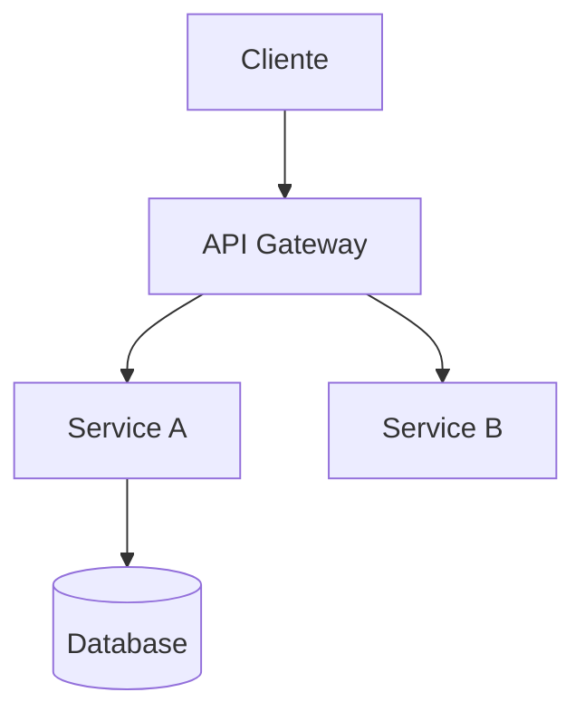

# Scaffold: SDD-Ready

> **ID:** `repo-scaffold/sdd-ready`
> **Descripción:** Scaffold para nuevos proyectos con Spec Driven Development
> **Estado:** draft

---

## Estructura del Scaffold

```
repo-sdd-ready/
├── .github/
│   ├── workflows/
│   │   ├── ci.yml
│   │   ├── pr-check.yml
│   │   └── release.yml
│   └── PULL_REQUEST_TEMPLATE.md
├── docs/
│   ├── system-spec.md          # Especificación del sistema (APB)
│   ├── adr/
│   │   └── 001-initial-architecture.md
│   ├── api/
│   │   └── openapi.yaml
│   └── runbooks/
│       └── deployment.md
├── src/
│   ├── Domain/
│   ├── Application/
│   ├── Infrastructure/
│   └── API/
├── tests/
│   ├── Unit/
│   ├── Integration/
│   └── E2E/
├── infrastructure/
│   ├── terraform/
│   │   ├── main.tf
│   │   ├── variables.tf
│   │   └── outputs.tf
│   └── bicep/
│       └── main.bicep
├── scripts/
│   ├── validate-spec.sh
│   └── generate-docs.sh
├── .editorconfig
├── .gitignore
├── Directory.Build.props
├── global.json
├── nuget.config
├── Dockerfile
├── docker-compose.yml
├── README.md
└── LICENSE
```

## Archivos Incluidos

### system-spec.md (Plantilla)
```markdown
# System Specification

> **Proyecto:** [Nombre del Proyecto]
> **Versión:** 1.0.0-draft
> **Fecha:** [YYYY-MM-DD]
> **Autor:** [Equipo/Agente]

## 1. Alcance

### 1.1 Objetivo
[Descripción del objetivo del sistema]

### 1.2 Contexto de Negocio
[Contexto del dominio de negocio]

### 1.3 Stakeholders
| Rol | Nombre | Responsabilidad |
|-----|--------|-----------------|
| Product Owner | [Nombre] | Definición de requisitos |
| Tech Lead | [Nombre] | Arquitectura técnica |
| QA Lead | [Nombre] | Calidad y testing |

## 2. Requisitos Funcionales

### 2.1 Épicas
| ID | Épica | Prioridad | Estado |
|----|-------|-----------|--------|
| EP-001 | [Nombre] | Alta | draft |

### 2.2 User Stories
| ID | Historia | Criterios de Aceptación | Épica |
|----|----------|------------------------|-------|
| US-001 | [Como... quiero... para...] | [Criterios] | EP-001 |

## 3. Arquitectura

### 3.1 Diagrama de Componentes


### 3.2 Stack Tecnológico
| Capa | Tecnología | Versión |
|------|-----------|---------|
| Backend | .NET | 8.0 |
| Frontend | DevExtreme JS | 23.2 |
| Base de datos | Azure SQL | 2022 |
| Mensajería | Azure Service Bus | — |

### 3.3 Bounded Contexts
| Contexto | Descripción | Responsable |
|----------|-------------|-------------|
| [Nombre] | [Descripción] | [Equipo] |

## 4. API Design

### 4.1 Contratos
[Referencia a openapi.yaml]

### 4.2 Eventos
| Evento | Productor | Consumidor | Schema |
|--------|-----------|------------|--------|
| [Nombre] | [Servicio] | [Servicio] | CloudEvents |

## 5. Calidad

### 5.1 Testing
- Cobertura mínima: 80%
- Tests unitarios: xUnit
- Tests E2E: Playwright
- Tests de seguridad: OWASP ZAP

### 5.2 Observabilidad
- Métricas: Application Insights
- Logs: Serilog + Seq
- Tracing: OpenTelemetry

### 5.3 SLOs
| Indicador | Objetivo | Ventana |
|-----------|----------|---------|
| Availability | 99.9% | 30 días |
| Latency p99 | < 500ms | 7 días |
| Error Rate | < 0.1% | 7 días |

## 6. Seguridad

### 6.1 Threat Model
[Referencia a threat-model.md]

### 6.2 Controles ENS
| Control | Implementación | Estado |
|---------|-----------------|--------|
| [Control] | [Descripción] | Pendiente |

## 7. Despliegue

### 7.1 Entornos
| Entorno | Infraestructura | Propósito |
|---------|----------------|-----------|
| Dev | Azure Container Apps | Desarrollo |
| Staging | Azure App Service | Validación |
| Prod | Azure App Service | Producción |

### 7.2 Pipeline CI/CD
[Referencia a .github/workflows/]

## 8. Gobierno

### 8.1 ADRs
| ID | Decisión | Estado |
|----|----------|--------|
| ADR-001 | [Decisión] | Aprobado |

### 8.2 Evidencias
| Tipo | Ubicación | Responsable |
|------|-----------|-------------|
| Testing | tests/evidence/ | QA Lead |
| Seguridad | docs/security/ | Security Lead |

## 9. Plan de Trabajo

### 9.1 Sprints
| Sprint | Objetivo | Fecha Inicio | Fecha Fin |
|--------|----------|-------------|-----------|
| Sprint 1 | [Objetivo] | [Fecha] | [Fecha] |

### 9.2 Dependencias
| Dependencia | Tipo | Estado |
|-------------|------|--------|
| [Sistema] | [API/DB/Evento] | [Estado] |

---
*Generado desde scaffold SDD-Ready — APB AI Framework*
```

## CI/CD Workflows

### ci.yml
```yaml
name: CI
on:
  push:
    branches: [main, develop]
  pull_request:
    branches: [main]
jobs:
  build:
    runs-on: ubuntu-latest
    steps:
      - uses: actions/checkout@v4
      - name: Setup .NET
        uses: actions/setup-dotnet@v4
        with:
          dotnet-version: '8.0.x'
      - name: Restore
        run: dotnet restore
      - name: Build
        run: dotnet build --no-restore --configuration Release
      - name: Test
        run: dotnet test --no-build --verbosity normal
      - name: SonarQube
        uses: SonarSource/sonarqube-scan-action@master
        env:
          SONAR_TOKEN: ${{ secrets.SONAR_TOKEN }}
```

## Scripts de Validación

### validate-spec.sh
```bash
#!/bin/bash
# Valida que system-spec.md existe y tiene estructura mínima
if [ ! -f "docs/system-spec.md" ]; then
    echo "❌ Error: docs/system-spec.md no encontrado"
    exit 1
fi

echo "✅ system-spec.md encontrado"
# Validaciones adicionales...
```

## Uso

```bash
# Crear nuevo proyecto desde scaffold
cookiecutter repo-scaffold/sdd-ready/
# o
cp -r repo-scaffold/sdd-ready/ mi-nuevo-proyecto/
cd mi-nuevo-proyecto
# Personalizar system-spec.md
# Iniciar desarrollo SDD
```

---
*Scaffold APB AI Framework v1.0.0*
