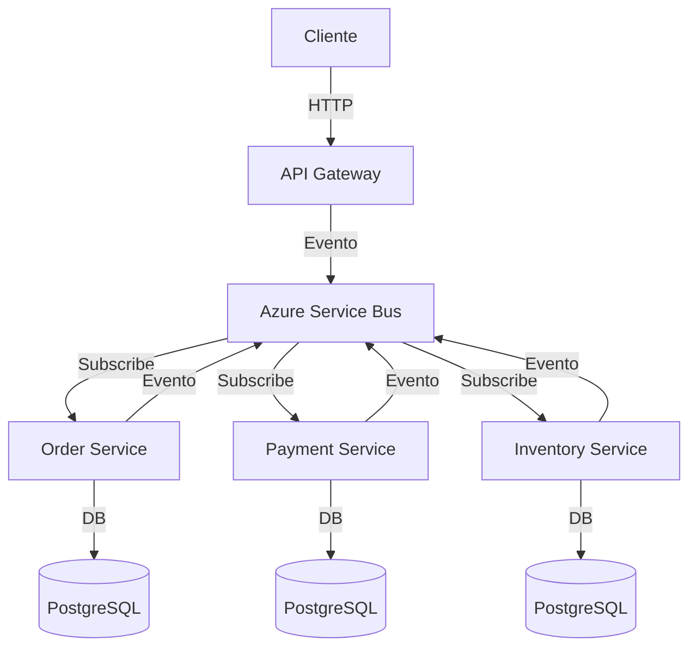

> Procedencia: Skill APB adaptada de bmad-method (licencia MIT) en su origen; el modelo de roles BMAD fue retirado en Sesión 8 — el contenido técnico de diseño de arquitectura event-driven se mantiene y se vincula a `apb-agent-technical-architect-v1.0`.

# APB Architecture Design: Diseño de Arquitectura de Eventos


## Contexto Corporativo APB

> Antes de ejecutar esta skill/agente, carga
> `context/apb/knowledge/APB_KNOWLEDGE_BASE.md` (provider: `prov-apb-knowledge-v1.0`).
> Úsalo para entender el dominio portuario, la terminología (CA/ES/EN) y los
> sistemas implicados. El legacy documentado (SÒSTRAT/Java/Oracle/CAS/Alfresco)
> es contexto informacional, **no prescripción tecnológica**.
> Stack aprobado: `context/apb/standards/STANDARD_ARCHITECTURE.md`

## Visión General

Diseño de arquitectura técnica que traduce requisitos de producto en decisiones de infraestructura, patrones y topología de eventos. Favorece tecnología "aburrida", productividad del desarrollador, y trade-offs sobre veredictos absolutos.

**Rol:** System Architect especializado en Azure Service Bus + CloudEvents.

## Cuándo Usar

- Después de completar `apb:pm-analysis` con product brief aprobado
- Cuando se necesita definir la topología de Service Bus
- Antes de cualquier implementación de microservicios
- Cuando se migra de monolito a microservicios
- Para revisar decisiones arquitectónicas existentes

## El Proceso

### Fase 1: Análisis de Requisitos Técnicos

Revisar el product brief y extraer requisitos técnicos:

```markdown
### Requisitos Técnicos Derivados

#### Volumen de Eventos
- **Pico:** [N] eventos/segundo
- **Promedio:** [N] eventos/segundo
- **Crecimiento esperado:** [X%] en [Y] meses

#### Latencia
- **Eventos críticos:** < [N] ms (p99)
- **Eventos normales:** < [N] ms (p95)
- **Eventos batch:** < [N] minutos

#### Garantías de Entrega
- **Eventos de orden:** exactly-once (con idempotencia)
- **Eventos de pago:** at-least-once + idempotencia
- **Eventos de analytics:** at-least-once (tolerante a duplicados)

#### Ordenamiento
- **Eventos por cliente:** Orden estricto (session keys)
- **Eventos independientes:** Sin orden requerido
- **Eventos de saga:** Orden parcial (por saga instance)

#### Retención
- **Eventos procesados:** [N] días
- **Eventos en DLQ:** [N] días
- **Eventos audit:** [N] años
```

### Fase 2: Diseño de Topología de Service Bus

#### Namespace

```
sb-apb-[env].servicebus.windows.net
├── Topics
│   ├── topic-[dominio-1]     (ej: topic-orders)
│   ├── topic-[dominio-2]     (ej: topic-payments)
│   ├── topic-[dominio-3]     (ej: topic-inventory)
│   └── topic-[dominio-N]
│
├── Queues
│   ├── q-[dominio]-deadletter  (DLQ por dominio)
│   └── q-[dominio]-retry       (Cola de reintentos)
│
└── Subscriptions (por topic)
    ├── sub-[servicio]-[evento]
    │   ├── Rule: type = '[namespace].[evento].*'
    │   ├── Lock duration: [30s | 5min]
    │   ├── Max delivery count: [10]
    │   ├── Enable sessions: [true | false]
    │   └── Forward dead letter: [q-orders-deadletter]
    └── ...
```

#### Decisiones de Topología

| Decisión | Opción | Justificación |
|----------|--------|---------------|
| **Topics por dominio vs unificado** | Por dominio | Mejor aislamiento, escalabilidad independiente |
| **Subscriptions por servicio o por evento** | Por servicio | Menos subscriptions, más simple de gestionar |
| **Sessions habilitados** | Solo donde se requiere orden | Costo de throughput |
| **Particionamiento** | Por sessionId (customerId) | Distribución de carga |
| **Geo-replicación** | Sí, para disaster recovery | RPO < 1 minuto |

### Fase 3: Diseño de Patrones

#### Patrón de Comunicación

```
┌─────────────────────────────────────────────────────────────┐
│                    Patrón de Comunicación                     │
├─────────────────────────────────────────────────────────────┤
│                                                             │
│   ┌─────────────┐      Evento       ┌─────────────┐        │
│   │  Servicio A │ ────────────────> │  Servicio B │        │
│   │  (Productor)│                   │ (Consumidor)│        │
│   └─────────────┘                   └─────────────┘        │
│          │                                │                │
│          │ Outbox Pattern                   │ Idempotencia   │
│          │ (garantía de entrega)           │ (deduplicación)│
│          ▼                                ▼                │
│   ┌─────────────┐                   ┌─────────────┐        │
│   │     DB      │                   │     DB      │        │
│   │  (transacción)                  │  (transacción)       │
│   └─────────────┘                   └─────────────┘        │
│                                                             │
│   Patrón: Coreografía (eventos coordinan)                    │
│   Alternativa: Orquestación (saga centralizada)              │
│                                                             │
└─────────────────────────────────────────────────────────────┘
```

#### Patrón de Saga

```
┌─────────────────────────────────────────────────────────────┐
│                    Patrón de Saga                            │
├─────────────────────────────────────────────────────────────┤
│                                                             │
│   Orquestación (recomendada para flujos complejos):         │
│                                                             │
│   ┌─────────────┐                                          │
│   │ Orquestador │                                          │
│   │   (Saga)    │                                          │
│   └──────┬──────┘                                          │
│          │                                                  │
│    ┌─────┼─────┬─────────┐                                │
│    ▼     ▼     ▼         ▼                                │
│ ┌────┐ ┌────┐ ┌────┐  ┌────┐                             │
│ │Inv │ │Pay │ │Ship│  │Not │                             │
│ │Svc │ │Svc │ │Svc│  │Svc │                             │
│ └────┘ └────┘ └────┘  └────┘                             │
│                                                             │
│   Coreografía (recomendada para flujos simples):           │
│                                                             │
│   OrderSvc ──OrderCreated──> InvSvc ──InvReserved──> PaySvc │
│      ▲                                                    │
│      └────────OrderConfirmed────────────PayCompleted──────┘│
│                                                             │
└─────────────────────────────────────────────────────────────┘
```

#### Patrón de Consistencia

```
┌─────────────────────────────────────────────────────────────┐
│              Patrón de Consistencia                         │
├─────────────────────────────────────────────────────────────┤
│                                                             │
│   Eventual Consistency (recomendada):                      │
│                                                             │
│   Servicio A ──Evento──> Servicio B (procesa eventualmente)│
│                                                             │
│   Compensación ante fallo:                                 │
│   Servicio B falla ──Evento de compensación──> Servicio A   │
│                                                             │
│   Strong Consistency (solo cuando es crítico):             │
│   Usar saga orquestada con verificación síncrona           │
│                                                             │
└─────────────────────────────────────────────────────────────┘
```

### Fase 4: Decisiones de Stack

| Componente | Elección | Alternativas Rechazadas | Justificación |
|------------|----------|------------------------|---------------|
| **Broker** | Azure Service Bus | Kafka, RabbitMQ, AWS SQS | Enterprise, managed, integración Azure |
| **Schemas** | JSON + CloudEvents 1.0 | Avro, Protobuf, XML | Interoperable, human-readable, no code generation |
| **UI** | DevExpress + JS puro | React, TypeScript, Angular | Stack existente del equipo, no overhead de build |
| **DB por servicio** | PostgreSQL | MongoDB, Cosmos DB | ACID, familiar, costo |
| **Cache** | Redis | Memcached | Estructuras de datos, pub/sub |
| **Observability** | Application Insights + Log Analytics | Datadog, New Relic | Integración Azure, costo |
| **CI/CD** | Azure DevOps | GitHub Actions, Jenkins | Integración Azure, pipelines YAML |

### Fase 5: Documento de Arquitectura

Generar `docs/apb/architecture/system-architecture.md`:

```markdown
# System Architecture: [Nombre del Sistema]

## Contexto
[Resumen del producto y objetivos]

## Diagrama de Componentes


## Topología de Service Bus
[Tabla de topics, subscriptions, rules]

## Patrones Aplicados
- [ ] Outbox Pattern
- [ ] Saga Orquestación
- [ ] CQRS (si aplica)
- [ ] Event Sourcing (si aplica)
- [ ] Circuit Breaker

## Decisiones Arquitectónicas
[Tabla de ADRs — Architecture Decision Records]

## Escalabilidad
- Throughput objetivo: [N] eventos/segundo
- Estrategia de escalado: [Horizontal | Vertical]

## Seguridad
- Autenticación: [Managed Identity | SAS]
- Autorización: [RBAC | Custom]
- Encriptación: [TLS 1.2 | En tránsito + en reposo]

## Disaster Recovery
- RPO: [N] minutos
- RTO: [N] minutos
- Estrategia: [Geo-replicación | Backup/Restore]

## Métricas y Alertas
| Métrica | Umbral | Acción |
|---------|--------|--------|
| DLQ messages > 0 | Inmediato | Alerta + investigación |
| Latencia p99 > 5s | 5 minutos | Escalar consumidores |
| Error rate > 1% | 1 minuto | Rollback investigación |
```

## Integración con el Flujo APB

```
apb:pm-analysis → [product brief] → apb:architecture-design → [system architecture] → apb:design-approval → apb:planning
```


## ⚠️ Comportamiento ante inputs incompletos

> El agente **nunca** debe continuar con inputs obligatorios vacíos o contradictorios sin comunicarlo explícitamente.

| Input | Si falta o es ambiguo | Bloquea ejecución |
|-------|-----------------------|-------------------|
| *(Sin inputs declarados)* | No aplica | No |

---

## Marcado IA obligatorio (POLICY_AI_USAGE §6)

Conforme al [`AI_MARKING_STANDARD`](../../../context/apb/standards/AI_MARKING_STANDARD.md), todo artefacto generado por esta skill debe incluir marca de origen IA:

- **Documentos Markdown** - callout inmediatamente tras el titulo H1:
  > **Borrador generado por IA** (APB AI Framework - apb-arch-design-events-v1.0) - pendiente validacion humana. No distribuir sin revision.
