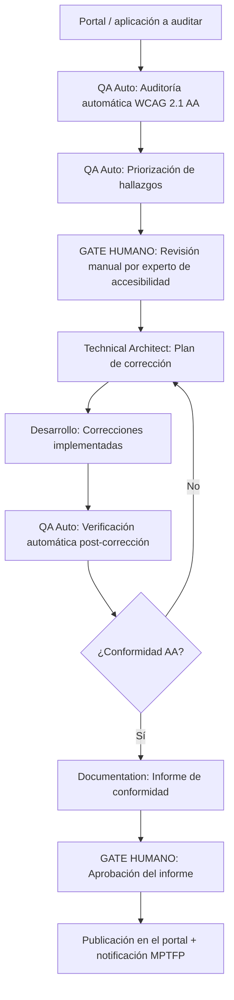

# Accessibility Audit

---

## 🎯 Objetivo

Garantizar que los portales web de APB orientados a ciudadanos y empresas cumplen con la obligación legal de accesibilidad (RD 1112/2018, transposición de la Directiva UE 2016/2102), alcanzando el nivel de conformidad WCAG 2.1 AA. El workflow estructura el proceso de auditoría, corrección y publicación del informe de conformidad exigido legalmente en el portal.

## 📊 Diagrama de Flujo



## 🎭 Agentes Participantes

| Orden | Agente | Rol | Herramientas |
|-------|--------|-----|--------------|
| 1 | QA Automation | Auditoría y verificación | axe-core, pa11y, Lighthouse, WAVE API |
| 2 | Technical Architect | Plan de corrección | Análisis de componentes DevExtreme / React afectados |
| 3 | Documentation | Informe de conformidad | Plantilla MPTFP para declaración de accesibilidad |

## 📡 Contratos de Output Inter-Agente

| Agente Origen | Agente Destino | Artefacto entregado | Formato |
|---------------|----------------|---------------------|---------|
| `apb-agent-qa-auto-v1.0` | `apb-agent-technical-architect-v1.0` | Informe de fase con hallazgos y recomendaciones | Markdown |
| `apb-agent-technical-architect-v1.0` | `apb-agent-documentation-v1.0` | Informe de fase con hallazgos y recomendaciones | Markdown |

## 📋 Fases del Workflow

### Fase 1 — Auditoría Automática WCAG 2.1 AA
- Agente: QA Automation
- **Herramientas:**
  - **axe-core:** análisis de accesibilidad integrado en el navegador — detección de violaciones WCAG
  - **pa11y:** auditoría de línea de comandos, ejecutable en CI/CD para regresión continua
  - **Lighthouse (accesibilidad):** scoring automatizado de accesibilidad en Chrome
  - **WAVE API:** detección de errores, alertas y características de accesibilidad en páginas web
- Cobertura automática: ~30% de los criterios de éxito WCAG 2.1 (los auditables sin criterio humano)
- Resultado: lista de violaciones con criterio WCAG, impacto (critical/serious/moderate/minor) y elemento afectado

### Fase 2 — Priorización de Hallazgos
- Agente: QA Automation
- **Criterios de priorización:**
  - Impacto en usuarios con discapacidad (critical/serious primero)
  - Frecuencia del componente afectado en el portal
  - Criterio WCAG (nivel A tiene prioridad sobre AA)
- Agrupar hallazgos por componente para eficiencia en las correcciones

### Fase 3 — Revisión Manual ⚠️ GATE HUMANO
- **Obligatoria** — la automatización no puede reemplazar la revisión humana para ~70% de los criterios WCAG
- El experto de accesibilidad revisa manualmente:
  - Navegación por teclado (foco visible, orden lógico, trampas de foco)
  - Compatibilidad con lectores de pantalla (NVDA + Chrome, VoiceOver + Safari)
  - Contraste de color en texto pequeño y componentes UI personalizados
  - Descripción alternativa de imágenes complejas y gráficos
  - Formularios: etiquetas, mensajes de error, instrucciones
  - Vídeos: subtítulos y audiodescripción

### Fase 4 — Plan de Corrección
- Agente: Technical Architect
- Analizar hallazgos e identificar los componentes DevExtreme / React que los generan
- Proponer correcciones técnicas concretas (atributos ARIA, roles semánticos, alternativas de texto)
- Estimar esfuerzo de corrección y priorizar según impacto
- Crear issues en Jira Software para cada grupo de correcciones

### Fase 5 — Corrección (ejecución por el equipo de desarrollo)
- El equipo de desarrollo implementa las correcciones propuestas
- El agente Technical Architect puede revisar los PRs para validar que las correcciones son correctas técnicamente

### Fase 6 — Verificación Post-Corrección
- Agente: QA Automation
- Re-ejecutar la suite de auditoría automática (axe-core + pa11y + Lighthouse)
- Si persisten violaciones → volver a Fase 4 con los hallazgos residuales
- Si se alcanza conformidad WCAG 2.1 AA → continuar

### Fase 7 — Informe de Conformidad
- Agente: Documentation
- Generar la **Declaración de Accesibilidad** en el formato exigido por MPTFP:
  - Estado de conformidad (conforme / parcialmente conforme / no conforme)
  - Contenido no accesible (si hay excepciones justificadas)
  - Mecanismo de contacto y solicitud de información
  - Procedimiento de aplicación (reclamación ante MPTFP)
  - Fecha de la última revisión
- **Gate humano:** el responsable del portal aprueba el informe antes de publicarlo

### Fase 8 — Publicación y Notificación
- Publicar la Declaración de Accesibilidad en el portal (enlace visible desde el footer)
- Notificar al MPTFP si aplica (portales en el ámbito del RD 1112/2018)
- Programar revisión anual obligatoria

## 📥 Input Inicial

- URL del portal o aplicación web a auditar
- Páginas clave a incluir en la auditoría (mínimo: home, formularios principales, proceso de tramitación)
- Responsable del portal (área y persona)
- Fecha objetivo para publicación del informe

## 📤 Output Final

- Informe de auditoría con hallazgos WCAG priorizados
- Issues de corrección en Jira Software
- Declaración de Accesibilidad publicada en el portal
- Evidencia de conformidad WCAG 2.1 AA en el repositorio de compliance

## 🔄 Puntos de Decisión

- **DP1:** ¿Hay violaciones de nivel A (el más básico)? Si sí → bloquear publicación hasta corrección.
- **DP2:** ¿Hay contenido que no puede hacerse accesible con carga desproporcionada? Si sí → documentar la excepción y alternativa en la Declaración de Accesibilidad.
- **DP3:** ¿Se alcanza conformidad AA? Si no → iterar correcciones hasta alcanzarlo o documentar excepciones justificadas.

## 🚫 Límites del Workflow

- NO puede reemplazar la revisión manual por un experto de accesibilidad — la automatización es complementaria
- NO puede publicar la Declaración de Accesibilidad sin aprobación humana
- NO gestiona la accesibilidad de apps móviles nativas — ese es un proceso separado (WCAG 2.1 + ATAG)
- Los portales con contenido de terceros (iframes, plugins externos) requieren evaluación separada del proveedor

## 🔒 Seguridad y Cumplimiento

- RD 1112/2018 (transposición Directiva UE 2016/2102) — obligatorio para organismos del sector público
- WCAG 2.1 nivel AA — estándar de referencia exigido legalmente
- La declaración de accesibilidad es un documento público — no incluir información sensible
- Las auditorías en entornos de producción deben realizarse en horario de baja carga para evitar impacto

## 🚨 Manejo de Fallos

> Documentar para cada fase qué ocurre si falla, si es bloqueante y quién decide la acción de recuperación.

| Fase | Fallo posible | ¿Bloqueante? | Acción del agente | Decisor |
|------|---------------|-------------|-------------------|---------|
| Fase 1 — Auditoría Automática WCAG 2.1 AA | Error técnico o datos insuficientes | Según severidad | Notificar al operador y documentar el estado alcanzado | Humano |
| Fase 2 — Priorización de Hallazgos | Error técnico o datos insuficientes | Según severidad | Notificar al operador y documentar el estado alcanzado | Humano |
| Fase 3 — Revisión Manual ⚠️ GATE HUMANO | Error técnico o datos insuficientes | Según severidad | Notificar al operador y documentar el estado alcanzado | Humano |
| Fase 4 — Plan de Corrección | Error técnico o datos insuficientes | Según severidad | Notificar al operador y documentar el estado alcanzado | Humano |
| Fase 5 — Corrección (ejecución por el equipo de desarrollo) | Error técnico o datos insuficientes | Según severidad | Notificar al operador y documentar el estado alcanzado | Humano |
| Fase 6 — Verificación Post-Corrección | Error técnico o datos insuficientes | Según severidad | Notificar al operador y documentar el estado alcanzado | Humano |
| Fase 7 — Informe de Conformidad | Error técnico o datos insuficientes | Según severidad | Notificar al operador y documentar el estado alcanzado | Humano |
| Fase 8 — Publicación y Notificación | Error técnico o datos insuficientes | Según severidad | Notificar al operador y documentar el estado alcanzado | Humano |

> **Principio general:** ante cualquier fallo no contemplado, el workflow se detiene, conserva el estado alcanzado y notifica al responsable humano con el contexto completo. Nunca continúa asumiendo que el fallo se resolverá solo.

## 📝 Ejemplo de Ejecución

```yaml
workflow: apb-wf-accessibility-audit-v1.0
inputs:
  portal_name: "Portal de Tramitación APB"
  base_url: "https://tramitacio.portdebarcelona.cat"
  key_pages:
    - "/"
    - "/solicitud-atraque"
    - "/pago-tributos"
    - "/documentacion"
  responsible_area: "Servicios al Cliente"
  responsible_person: "responsable-portal@portdebarcelona.cat"
  target_compliance_date: "2026-09-30"
```

## 🔄 Historial de Cambios

| Versión | Fecha | Autor | Cambio |
|---------|-------|-------|--------|
| 1.0.0 | 2026-06-29 | Arquitectura APB | Creación inicial — Sesión Enriquecimiento C2 |

---
*Documento generado por el APB AI Framework. Requiere revisión humana antes de aprobación.*

---

## Marcado IA obligatorio (POLICY_AI_USAGE §6)

Conforme al [`AI_MARKING_STANDARD`](../context/apb/standards/AI_MARKING_STANDARD.md), todo artefacto generado por este workflow debe incluir marca de origen IA:

- **Documentos Markdown** (informe de auditoría, Declaración de Accesibilidad):
  > ⚠️ **Borrador generado por IA** (APB AI Framework — apb-wf-accessibility-audit-v1.0) — pendiente validación humana y aprobación del responsable del portal. No publicar sin revisión.
- **Commits**: prefijo `[ai-gen]` + `Co-Authored-By: APB AI Framework <framework@portdebarcelona.cat>`.
