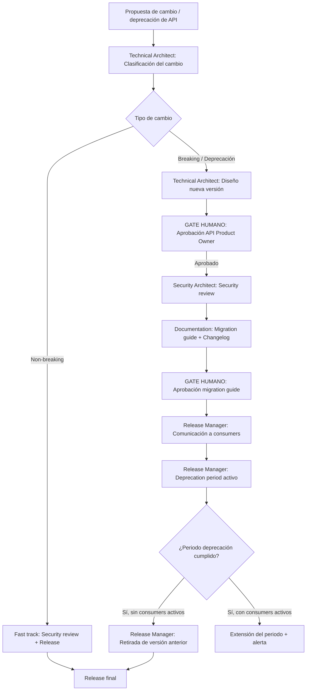

# API Lifecycle Management

---

## 🎯 Objetivo

Gestionar de forma estructurada los cambios en las APIs del catálogo APB: nuevas versiones, cambios breaking, deprecaciones y retiradas. Garantiza que los consumers de cada API reciben comunicación anticipada con tiempo suficiente para adaptarse, y que ningún breaking change llega a producción sin proceso formal de deprecación.

## 📊 Diagrama de Flujo



## 🎭 Agentes Participantes

| Orden | Agente | Rol | Acción |
|-------|--------|-----|--------|
| 1 | Technical Architect | Diseño | Clasificar cambio, diseñar nueva versión, estrategia de versionado |
| 2 | Security Architect | Seguridad | Security review de los nuevos endpoints y cambios de autenticación |
| 3 | Documentation | Comunicación | Migration guide, changelog, OpenAPI actualizado |
| 4 | Release Manager | Release | Comunicación a consumers, gestión del periodo de deprecación |

## 📡 Contratos de Output Inter-Agente

| Agente Origen | Agente Destino | Artefacto entregado | Formato |
|---------------|----------------|---------------------|---------|
| `apb-agent-technical-architect-v1.0` | `apb-agent-security-architect-v1.0` | Informe de fase con hallazgos y recomendaciones | Markdown |
| `apb-agent-security-architect-v1.0` | `apb-agent-documentation-v1.0` | Informe de fase con hallazgos y recomendaciones | Markdown |
| `apb-agent-documentation-v1.0` | `apb-agent-release-manager-v1.0` | Informe de fase con hallazgos y recomendaciones | Markdown |

## 📋 Fases del Workflow

### Fase 1 — Clasificación del Cambio
- Agente: Technical Architect
- **Non-breaking changes** (fast track, sin periodo de deprecación):
  - Nuevos endpoints opcionales
  - Nuevos campos opcionales en responses
  - Mejoras de rendimiento sin cambio de contrato
  - Corrección de bugs que no alteran el contrato
- **Breaking changes** (requieren deprecación formal):
  - Eliminación o renombrado de endpoints, parámetros o campos
  - Cambio en tipos de datos o validaciones que rechacen inputs antes válidos
  - Cambio en autenticación (OAuth scopes, headers requeridos)
  - Cambio en estructura de errores
- **Deprecación:** eliminar soporte de una versión entera de la API

### Fase 2 — Diseño de la Nueva Versión
- Agente: Technical Architect
- Estrategia de versionado APB: URI versioning (`/v1/`, `/v2/`) como estándar
- Mantener versión anterior activa durante el periodo de deprecación (mínimo 6 meses para APIs en producción)
- Diseño del contrato OpenAPI de la nueva versión
- Identificar todos los consumers afectados (vía APB-DOMAIN-CATALOG y logs de Azure API Management)

### Fase 3 — Aprobación del API Product Owner ⚠️ GATE HUMANO
- El API Product Owner del área responsable aprueba el diseño de la nueva versión y el deprecation plan
- Confirma que el periodo de deprecación es suficiente para los consumers identificados
- Aprueba la fecha objetivo de retirada de la versión anterior

### Fase 4 — Security Review
- Agente: Security Architect
- Revisar que los nuevos endpoints siguen los estándares de autenticación APB (OAuth 2.0 / Azure AD)
- Verificar que no se exponen datos no previstos en el contrato
- Validar que los cambios de autenticación no crean vectores de ataque nuevos
- Confirmar compliance ENS para APIs con nivel de clasificación Medio o Alto

### Fase 5 — Migration Guide y Changelog
- Agente: Documentation
- Generar migration guide para consumers: qué cambia, qué deben modificar, ejemplos de before/after
- Actualizar OpenAPI/Swagger con la nueva versión y deprecation notices en los endpoints afectados
- Publicar changelog en Confluence (espacio de la API)
- **Gate humano:** el API Product Owner revisa y aprueba el migration guide antes de comunicarlo

### Fase 6 — Comunicación a Consumers
- Agente: Release Manager
- Notificación vía Teams/email a todos los consumers identificados con:
  - Fecha de disponibilidad de la nueva versión
  - Fecha de fin de soporte de la versión anterior
  - Enlace al migration guide
  - Canal de soporte para dudas de migración
- Apertura del periodo de deprecación formal (mínimo 6 meses para APIs en producción, mínimo 1 mes para APIs en staging)

### Fase 7 — Periodo de Deprecación
- Agente: Release Manager (monitorización periódica)
- Monitorizar el uso de la versión anterior en Azure API Management (métricas de tráfico por versión)
- Enviar recordatorios a consumers que aún usan la versión antigua a los 30, 60 y 90 días del periodo de deprecación
- Si hay consumers activos al final del periodo → evaluar extensión o escalado al API Product Owner

### Fase 8 — Retirada de la Versión Anterior
- Agente: Release Manager
- Cuando el tráfico a la versión anterior es 0 durante 7 días consecutivos → proponer retirada
- RFC en `apb-wf-change-management-v1.0` para la retirada del endpoint
- La versión retirada queda archivada en el domain catalog con estado `retired`

## 📥 Input Inicial

- Descripción del cambio propuesto (qué, por qué, qué APIs afecta)
- Tipo de cambio (non-breaking / breaking / deprecación de versión)
- Propietario del área responsable de la API
- Fecha objetivo de la nueva versión

## 📤 Output Final

- Nueva versión de la API disponible en producción con OpenAPI actualizado
- Migration guide publicado en Confluence
- Consumers notificados con periodo de deprecación activo
- Versión anterior retirada (al final del periodo de deprecación)

## 🔄 Puntos de Decisión

- **DP1:** ¿El cambio es breaking? Si no → fast track sin deprecación formal.
- **DP2:** ¿El API Product Owner aprueba el deprecation plan? Si no → revisión del plan y/o periodo.
- **DP3:** ¿Hay consumers activos al final del periodo de deprecación? Si sí → extensión o escalado.

## 🚫 Límites del Workflow

- NO puede retirar una versión de API con consumers activos sin aprobación explícita del API Product Owner
- NO puede reducir el periodo de deprecación por debajo de 1 mes sin aprobación del Comité de Arquitectura APB
- NO gestiona APIs de terceros (Azure, SAP, etc.) — solo APIs internas del catálogo APB
- El workflow asume que existe un APB-DOMAIN-CATALOG poblado para identificar consumers — en ausencia del catálogo, la identificación de consumers es manual

## 🔒 Seguridad y Cumplimiento

- Todas las APIs siguen OAuth 2.0 / Azure AD como mecanismo de autenticación
- Los cambios en autenticación requieren security review completo antes del release
- Las APIs con datos personales deben actualizar el Registro art. 30 si el cambio afecta a categorías o finalidades del tratamiento

## 🚨 Manejo de Fallos

> Documentar para cada fase qué ocurre si falla, si es bloqueante y quién decide la acción de recuperación.

| Fase | Fallo posible | ¿Bloqueante? | Acción del agente | Decisor |
|------|---------------|-------------|-------------------|---------|
| Fase 1 — Clasificación del Cambio | Error técnico o datos insuficientes | Según severidad | Notificar al operador y documentar el estado alcanzado | Humano |
| Fase 2 — Diseño de la Nueva Versión | Error técnico o datos insuficientes | Según severidad | Notificar al operador y documentar el estado alcanzado | Humano |
| Fase 3 — Aprobación del API Product Owner ⚠️ GATE HUMANO | Error técnico o datos insuficientes | Según severidad | Notificar al operador y documentar el estado alcanzado | Humano |
| Fase 4 — Security Review | Error técnico o datos insuficientes | Según severidad | Notificar al operador y documentar el estado alcanzado | Humano |
| Fase 5 — Migration Guide y Changelog | Error técnico o datos insuficientes | Según severidad | Notificar al operador y documentar el estado alcanzado | Humano |
| Fase 6 — Comunicación a Consumers | Error técnico o datos insuficientes | Según severidad | Notificar al operador y documentar el estado alcanzado | Humano |
| Fase 7 — Periodo de Deprecación | Error técnico o datos insuficientes | Según severidad | Notificar al operador y documentar el estado alcanzado | Humano |
| Fase 8 — Retirada de la Versión Anterior | Error técnico o datos insuficientes | Según severidad | Notificar al operador y documentar el estado alcanzado | Humano |

> **Principio general:** ante cualquier fallo no contemplado, el workflow se detiene, conserva el estado alcanzado y notifica al responsable humano con el contexto completo. Nunca continúa asumiendo que el fallo se resolverá solo.

## 📝 Ejemplo de Ejecución

```yaml
workflow: apb-wf-api-lifecycle-v1.0
inputs:
  api_name: "API de Atraques"
  api_current_version: "v1"
  change_type: "breaking"
  change_description: "Renombrado del campo 'fecha_llegada' a 'arrival_datetime' (ISO 8601 con timezone) y añadir campo 'vessel_imo' como obligatorio"
  affected_consumers:
    - "apb-app-gispem"
    - "apb-app-portic-integration"
    - "apb-dashboard-operaciones"
  api_product_owner: "responsable-maritimo@portdebarcelona.cat"
  target_new_version_date: "2026-08-01"
  deprecation_period_months: 6
```

## 🔄 Historial de Cambios

| Versión | Fecha | Autor | Cambio |
|---------|-------|-------|--------|
| 1.0.0 | 2026-06-29 | Arquitectura APB | Creación inicial — Sesión Enriquecimiento C2 |

---
*Documento generado por el APB AI Framework. Requiere revisión humana antes de aprobación.*

---

## Marcado IA obligatorio (POLICY_AI_USAGE §6)

Conforme al [`AI_MARKING_STANDARD`](../context/apb/standards/AI_MARKING_STANDARD.md), todo artefacto generado por este workflow debe incluir marca de origen IA:

- **Documentos Markdown** (migration guide, changelog, OpenAPI):
  > ⚠️ **Borrador generado por IA** (APB AI Framework — apb-wf-api-lifecycle-v1.0) — pendiente validación humana. No distribuir sin revisión.
- **Commits**: prefijo `[ai-gen]` + `Co-Authored-By: APB AI Framework <framework@portdebarcelona.cat>`.
