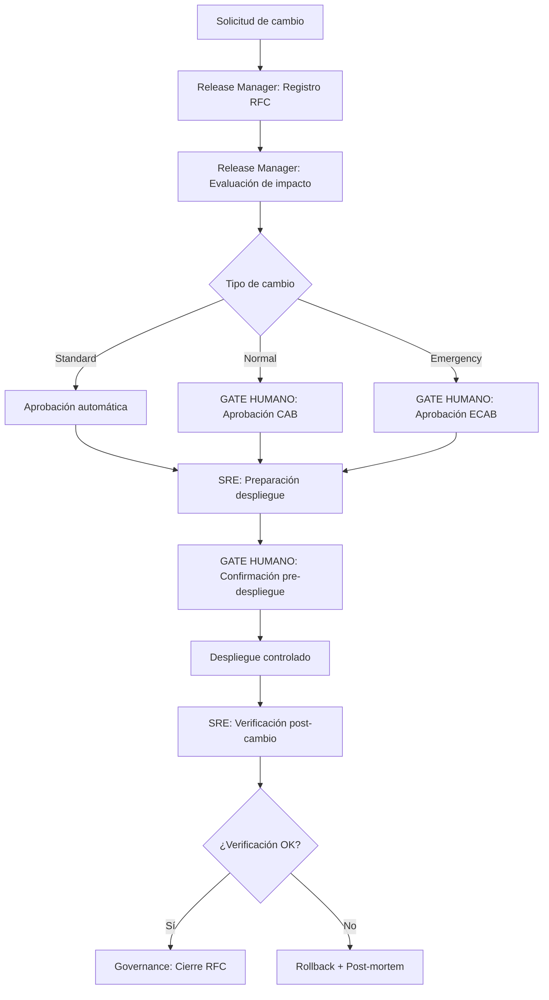

# Change Management

---

## 🎯 Objetivo

Garantizar que todo cambio en sistemas productivos APB siga un proceso estructurado: registro, evaluación de impacto, aprobación del CAB (Change Advisory Board), despliegue controlado y verificación post-cambio. Cierra el gap ITIL crítico del framework: sin este workflow, el Release Manager puede desplegar sin RFC aprobado.

## 📊 Diagrama de Flujo



## 🎭 Agentes Participantes

| Orden | Agente | Rol | Acción |
|-------|--------|-----|--------|
| 1 | Release Manager | Registro y clasificación | Crear RFC, evaluar impacto, clasificar tipo de cambio |
| 2 | Governance | Aprobación CAB | Validar RFC completo, comprobar compliance ENS, aprobar/rechazar |
| 3 | SRE | Preparación y verificación | Plan de despliegue, rollback plan, verificación post-cambio |

## 📡 Contratos de Output Inter-Agente

| Agente Origen | Agente Destino | Artefacto entregado | Formato |
|---------------|----------------|---------------------|---------|
| `apb-agent-release-manager-v1.0` | `apb-agent-governance-v1.0` | Informe de fase con hallazgos y recomendaciones | Markdown |
| `apb-agent-governance-v1.0` | `apb-agent-sre-v1.0` | Informe de fase con hallazgos y recomendaciones | Markdown |

## 📋 Fases del Workflow

### Fase 1 — Registro del RFC
- Agente: Release Manager
- Entradas: descripción del cambio, sistemas afectados, solicitante, fecha objetivo
- Salidas: RFC con ID único (`RFC-YYYY-NNNN`), clasificación de tipo (Standard / Normal / Emergency)
- **Tipos de cambio:**
  - **Standard:** cambio pre-aprobado de bajo riesgo (actualización de configuración menor, parche de seguridad conocido). Sin CAB.
  - **Normal:** cambio planificado con evaluación de impacto completa. Requiere CAB.
  - **Emergency:** cambio urgente para resolver incidente crítico activo. Requiere ECAB (subconjunto reducido del CAB con disponibilidad inmediata).

### Fase 2 — Evaluación de Impacto
- Agente: Release Manager
- Análisis de riesgo (bajo / medio / alto / crítico)
- Identificación de sistemas afectados y dependencias
- Plan de rollback documentado
- Ventana de cambio propuesta (maintenance window APB: lunes-viernes 06:00-07:00 CET, salvo emergency)

### Fase 3 — Aprobación CAB ⚠️ GATE HUMANO
- Responsable: CAB (director TI + responsables de sistemas afectados)
- El RFC completo con evaluación de impacto se presenta al CAB
- **Decisión:** Aprobado / Aprobado con condiciones / Rechazado / Pospuesto
- Rechazado o Pospuesto → el RFC vuelve al solicitante para revisión
- Duración objetivo para cambios Normal: ≤48h desde registro

### Fase 4 — Preparación del Despliegue
- Agente: SRE
- Genera checklist de despliegue basado en el RFC aprobado
- Valida que el entorno de staging está en el estado esperado
- Confirma disponibilidad del equipo de guardia durante la ventana

### Fase 5 — Confirmación Pre-Despliegue ⚠️ GATE HUMANO
- El técnico responsable del despliegue revisa el checklist
- Confirmación explícita antes de iniciar el despliegue en producción

### Fase 6 — Despliegue Controlado
- Ejecutado por el técnico (no por el agente — autonomía nivel 1)
- El agente SRE monitoriza métricas durante el despliegue
- Criterios de abort automático: si las métricas críticas superan umbral → rollback inmediato

### Fase 7 — Verificación Post-Cambio
- Agente: SRE
- Verificación de los criterios de éxito definidos en el RFC
- Revisión de alertas activas en Azure Monitor / Zabbix / Grafana
- Duración: monitorización activa durante ≥30 minutos post-despliegue

### Fase 8 — Cierre del RFC
- Agente: Governance
- RFC cerrado con estado: Implementado con éxito / Implementado con incidencias / Revertido
- Si hay incidencias → apertura automática de ticket de Problema (`apb-wf-problem-management-v1.0`)

## 📥 Input Inicial

- Descripción del cambio (qué, por qué, qué sistemas afecta)
- Referencia al ticket de desarrollo o incidencia que motiva el cambio
- Fecha objetivo y ventana preferida
- Responsable técnico del despliegue

## 📤 Output Final

- RFC cerrado con historial completo (registro → aprobación → despliegue → verificación)
- Informe post-cambio (`change-report-RFC-YYYY-NNNN.md`)
- Notificación a partes interesadas

## 🔄 Puntos de Decisión

- **DP1:** ¿El cambio es Standard, Normal o Emergency? Determina el flujo de aprobación.
- **DP2:** ¿El CAB aprueba el RFC? Si no, el workflow se detiene y el RFC vuelve al solicitante.
- **DP3:** ¿La verificación post-cambio es exitosa? Si no, activar rollback y abrir ticket de Problema.

## 🚫 Límites del Workflow

- NO puede ejecutar el despliegue directamente — el técnico es quien despliega
- NO puede aprobar su propio RFC (autonomía nivel 1 — el CAB siempre es humano)
- NO gestiona cambios en infraestructura de seguridad (firewall, certificados) sin validación adicional del CISO
- Emergency changes no pueden saltarse la aprobación ECAB — solo reducen el quórum del CAB

## 🔒 Seguridad y Cumplimiento

- Todo RFC queda registrado con trazabilidad completa para auditoría ENS
- Los cambios en sistemas clasificados Nivel Alto ENS requieren aprobación del CISO además del CAB
- Uso de Azure Key Vault para cualquier credencial utilizada durante el despliegue
- Registro de auditoría en Jira Service Management con estados y fechas

## 🚨 Manejo de Fallos

> Documentar para cada fase qué ocurre si falla, si es bloqueante y quién decide la acción de recuperación.

| Fase | Fallo posible | ¿Bloqueante? | Acción del agente | Decisor |
|------|---------------|-------------|-------------------|---------|
| Fase 1 — Registro del RFC | Error técnico o datos insuficientes | Según severidad | Notificar al operador y documentar el estado alcanzado | Humano |
| Fase 2 — Evaluación de Impacto | Error técnico o datos insuficientes | Según severidad | Notificar al operador y documentar el estado alcanzado | Humano |
| Fase 3 — Aprobación CAB ⚠️ GATE HUMANO | Error técnico o datos insuficientes | Según severidad | Notificar al operador y documentar el estado alcanzado | Humano |
| Fase 4 — Preparación del Despliegue | Error técnico o datos insuficientes | Según severidad | Notificar al operador y documentar el estado alcanzado | Humano |
| Fase 5 — Confirmación Pre-Despliegue ⚠️ GATE HUMANO | Error técnico o datos insuficientes | Según severidad | Notificar al operador y documentar el estado alcanzado | Humano |
| Fase 6 — Despliegue Controlado | Error técnico o datos insuficientes | Según severidad | Notificar al operador y documentar el estado alcanzado | Humano |
| Fase 7 — Verificación Post-Cambio | Error técnico o datos insuficientes | Según severidad | Notificar al operador y documentar el estado alcanzado | Humano |
| Fase 8 — Cierre del RFC | Error técnico o datos insuficientes | Según severidad | Notificar al operador y documentar el estado alcanzado | Humano |

> **Principio general:** ante cualquier fallo no contemplado, el workflow se detiene, conserva el estado alcanzado y notifica al responsable humano con el contexto completo. Nunca continúa asumiendo que el fallo se resolverá solo.

## 📝 Ejemplo de Ejecución

```yaml
workflow: apb-wf-change-management-v1.0
inputs:
  change_description: "Actualización de Azure App Service de .NET 6 a .NET 8 en apb-api-atraques"
  affected_systems:
    - "apb-api-atraques (Azure App Service)"
    - "apb-db-atraques (Azure SQL)"
  requestor: "jlopez@portdebarcelona.cat"
  change_type: "Normal"
  target_date: "2026-07-03"
  maintenance_window: "06:00-07:00 CET"
  rollback_plan: "Revert App Service slot swap desde staging"
  linked_ticket: "APB-789"
```

## 🔄 Historial de Cambios

| Versión | Fecha | Autor | Cambio |
|---------|-------|-------|--------|
| 1.0.0 | 2026-06-29 | Arquitectura APB | Creación inicial — Sesión Enriquecimiento C2 |

---
*Documento generado por el APB AI Framework. Requiere revisión humana antes de aprobación.*

---

## Marcado IA obligatorio (POLICY_AI_USAGE §6)

Conforme al [`AI_MARKING_STANDARD`](../context/apb/standards/AI_MARKING_STANDARD.md), todo artefacto generado por este workflow debe incluir marca de origen IA:

- **Documentos Markdown** (RFC, informe post-cambio):
  > ⚠️ **Borrador generado por IA** (APB AI Framework — apb-wf-change-management-v1.0) — pendiente validación humana. No distribuir sin revisión.
- **Tickets Jira/JSM**: label `ia-generado` + footer en descripción.
- **Commits**: prefijo `[ai-gen]` + `Co-Authored-By: APB AI Framework <framework@portdebarcelona.cat>`.
