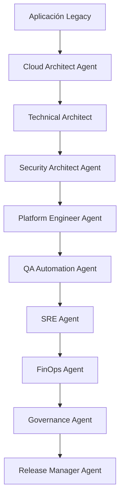

# Cloud Migration

---

## 🎯 Objetivo

Migrar una aplicación legacy a cloud con validación completa de infraestructura, seguridad, operabilidad y costes.

## 📊 Diagrama de Flujo



## 🎭 Agentes Participantes

| Orden | Agente | Rol | Skills Utilizadas |
|-------|--------|-----|-------------------|
| 1 | Cloud Architect Agent | Diseño cloud y readiness | `apb-plat-cloud-ready`, `apb-plat-terraform`, `apb-plat-finops` |
| 2 | Technical Architect | Arquitectura de migración | `apb-arch-decompose`, `apb-arch-cloud-infra` |
| 3 | Security Architect Agent | Seguridad cloud | `apb-sec-threat-model`, `apb-sec-ens`, `apb-arch-security-design` |
| 4 | Platform Engineer Agent | Infraestructura y CI/CD | `apb-plat-docker`, `apb-plat-cicd`, `apb-plat-db-migration` |
| 5 | QA Automation Agent | Validación post-migración | `apb-qa-post-migration`, `apb-qa-test-plan` |
| 6 | SRE Agent | Operabilidad y observabilidad | `apb-ops-operability`, `apb-ops-observability`, `apb-ops-prr` |
| 7 | FinOps Agent | Optimización de costes | `apb-plat-finops` |
| 8 | Governance Agent | Validación de gobierno | `apb-gov-compliance` |
| 9 | Release Manager Agent | Coordinación de release | `apb-qa-release-ready` |

## 📋 Fases del Workflow

### Fase 1: Evaluación de Readiness
- Análisis de preparación para cloud
- Identificación de dependencias y bloqueadores
- Gap analysis

### Fase 2: Diseño de Arquitectura Cloud
- Diseño de infraestructura cloud-native
- Definición de estrategia de migración (lift-and-shift, re-platform, re-architect)
- Diseño de networking y seguridad cloud

### Fase 3: Seguridad Cloud
- Threat modeling para entorno cloud
- Validación ENS en configuración cloud
- Diseño de IAM y network segmentation

### Fase 4: Infraestructura y CI/CD
- Generación de templates Terraform
- Dockerización de aplicaciones
- Configuración de pipelines CI/CD cloud
- Migración de base de datos

### Fase 5: Validación QA
- Tests de validación post-migración
- Comparación de resultados legacy vs cloud
- Tests de rendimiento y carga

### Fase 6: Operabilidad
- Diseño de observabilidad (métricas, logs, traces)
- Configuración de alertas y runbooks
- Production Readiness Review

### Fase 7: FinOps
- Estimación de costes cloud
- Configuración de budgets y alertas
- Recomendaciones de optimización

### Fase 8: Gobierno y Release
- Validación de cumplimiento
- Decisión de go/no-go para migración

## 📥 Input Inicial

- Aplicación legacy a migrar
- Base de datos legacy
- Requisitos de disponibilidad y rendimiento
- Presupuesto para cloud
- Requisitos de compliance (ENS, etc.)

## 📤 Output Final

- Aplicación migrada y operativa en cloud
- Infraestructura como código (Terraform)
- Pipelines CI/CD configurados
- Observabilidad configurada
- Informe de validación post-migración
- Análisis FinOps con budgets
- Documentación de migración y ADRs

## 🔄 Puntos de Decisión

- **DP1:** ¿La evaluación de readiness es favorable? Si no, requiere remediación.
- **DP2:** ¿El diseño cloud pasa threat modeling? Si no, iterar con Security Architect.
- **DP3:** ¿La migración de datos es exitosa? Validar con QA.
- **DP4:** ¿Los costes estimados están dentro del presupuesto? Si no, optimizar.
- **DP5:** ¿Pasa PRR de SRE? Si no, corregir findings.
- **DP6:** ¿Decisión de go/no-go? Requiere aprobación humana.

## 🚫 Límites y Escapes

- NO puede ejecutar migración en producción sin aprobación
- NO puede ignorar findings de seguridad críticos
- La migración debe incluir plan de rollback
- Requiere validación humana para decisiones críticas

## 🔒 Seguridad y Cumplimiento

- Threat modeling específico para cloud
- Validación ENS en configuración cloud
- Uso de Azure Key Vault para secretos
- Network segmentation y private endpoints
- Auditoría de cambios en infraestructura

## 📝 Ejemplo de Ejecución

```yaml
workflow: apb-wf-cloud-migration-v1.0
inputs:
  workflow: "apb-wf-cloud-migration-v1.0"
  inputs:
    legacy_app:
      repo: "/repos/legacy-system"
      database: "ref:akv/legacy-db-conn"
    cloud_provider: "Azure"
    migration_strategy: "re-platform"
    target_services:
      - "Azure App Service"
      - "Azure SQL"
      - "Azure Service Bus"
    budget_eur: 10000
    availability_target: "99.9%"
    compliance:
      - "ENS"
    output_format: "cloud-migration-package"
```

## 🔄 Historial de Cambios

| Versión | Fecha | Autor | Cambio |
|---------|-------|-------|--------|
| 1.0.0 | 2026-06-21 | Arquitectura APB | Creación inicial |

---
*Documento generado por el APB AI Framework. Requiere revisión humana antes de aprobación.*
