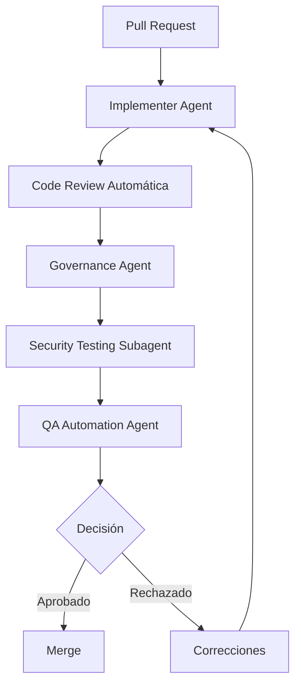

# Code Review Asistido

---

## 🎯 Objetivo

Revisión de código asistida por IA con cumplimiento de estándares, validación de calidad, seguridad y generación de evidencias para gobierno.

## 📊 Diagrama de Flujo



## 🎭 Agentes Participantes

| Orden | Agente | Rol | Skills Utilizadas |
|-------|--------|-----|-------------------|
| 1 | Implementer Agent | Autor del código | `apb-dev-implement`, `apb-dev-pr-doc` |
| 2 | Governance Agent | Validación de estándares | `apb-gov-standards`, `apb-gov-compliance` |
| 3 | Security Testing Subagent | Análisis de seguridad | `apb-dev-openspec-review`, `apb-sec-owasp` |
| 4 | QA Automation Agent | Validación de calidad | `apb-qa-unit-test-gen`, `apb-qa-test-auto` |

## 📋 Fases del Workflow

### Fase 1: Preparación de PR
- Implementer Agent prepara pull request con documentación
- Incluye descripción de cambios, tests, y evidencias

### Fase 2: Code Review Automática
- Análisis estático de código (SonarQube)
- Validación de estándares de codificación APB
- Verificación de cobertura de tests

### Fase 3: Validación de Seguridad
- Análisis estático de seguridad
- Validación OWASP
- Verificación de no exposición de secretos

### Fase 4: Validación de Calidad
- Ejecución de tests unitarios
- Validación de cobertura ≥ 80%
- Tests de integración si aplica

### Fase 5: Decisión
- Aprobación si pasa todos los gates
- Rechazo con comentarios detallados si falla algún gate
- Iteración hasta aprobación

## 📥 Input Inicial

- Pull request con código y documentación
- Tests unitarios ejecutados
- Descripción de cambios
- Evidencias de testing

## 📤 Output Final

- Pull request aprobado o rechazado con feedback
- Informe de code review
- Evidencias de calidad y seguridad
- Registro en catálogo de gobierno

## 🔄 Puntos de Decisión

- **DP1:** ¿Pasa análisis estático de código? Si no, requiere correcciones.
- **DP2:** ¿Pasa validación de seguridad? Si no, bloquear hasta resolución.
- **DP3:** ¿Cobertura de tests ≥ 80%? Si no, requiere más tests.
- **DP4:** ¿Pasa validación de estándares? Si no, aplicar correcciones.
- **DP5:** ¿Decisión de aprobación? Requiere validación humana final.

## 🚫 Límites y Escapes

- NO puede aprobar PR sin validación humana
- NO puede ignorar hallazgos de seguridad
- Los rechazos deben incluir feedback accionable
- Requiere re-ejecución de tests tras correcciones

## 🔒 Seguridad y Cumplimiento

- No exposición de secretos en código
- Validación OWASP en cada PR
- Análisis estático de seguridad automatizado
- Auditoría de decisiones de code review
- Trazabilidad de cambios

## 📝 Ejemplo de Ejecución

```yaml
workflow: apb-wf-code-review-v1.0
inputs:
  workflow: "apb-wf-code-review-v1.0"
  inputs:
    pull_request:
      repo: "apb/tributos-service"
      branch: "feature/new-module"
      commit: "abc123"
    author: "Implementer Agent"
    review_gates:
      - "static-analysis"
      - "security-scan"
      - "test-coverage"
      - "standards-compliance"
    coverage_threshold: 80
    output_format: "code-review-report.md"
```

## 🔄 Historial de Cambios

| Versión | Fecha | Autor | Cambio |
|---------|-------|-------|--------|
| 1.0.0 | 2026-06-21 | Arquitectura APB | Creación inicial |

---
*Documento generado por el APB AI Framework. Requiere revisión humana antes de aprobación.*
