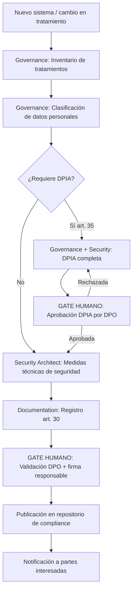

# Data Governance RGPD

---

## 🎯 Objetivo

Automatizar y estructurar el cumplimiento del RGPD en APB, con foco en el Registro de Actividades de Tratamiento (art. 30) y la Evaluación de Impacto en la Protección de Datos (DPIA, art. 35). El workflow garantiza que cualquier nuevo sistema, proceso o integración que trate datos personales queda registrado, clasificado y evaluado antes de entrar en producción.

## 📊 Diagrama de Flujo



## 🎭 Agentes Participantes

| Orden | Agente | Rol | Acción |
|-------|--------|-----|--------|
| 1 | Governance | Inventario y clasificación | Identificar tratamientos, categorías de datos, bases jurídicas, retenciones |
| 2 | Security Architect | Medidas técnicas | Evaluar riesgos para los derechos y libertades, proponer salvaguardas |
| 3 | Documentation | Registro art. 30 | Generar y publicar el registro formal en el repositorio de compliance APB |

## 📋 Fases del Workflow

### Fase 1 — Inventario de Tratamientos
- Agente: Governance
- Identificar todos los tratamientos de datos personales del sistema/proceso analizado
- Para cada tratamiento: nombre, finalidad, base jurídica (art. 6 RGPD), categorías de datos, titulares de los datos, destinatarios, transferencias internacionales
- Determinar si los datos incluyen categorías especiales (art. 9 RGPD: salud, origen étnico, datos sindicales, biométricos)

### Fase 2 — Clasificación de Datos Personales
- Agente: Governance
- Clasificar según nivel de sensibilidad APB:
  - **Nivel 1 — Básico:** nombre, email corporativo, puesto, teléfono profesional
  - **Nivel 2 — Sensible:** DNI/NIF, email personal, teléfono personal, datos de nómina, evaluaciones de rendimiento
  - **Nivel 3 — Muy sensible:** datos de salud, datos sindicales, datos biométricos, sanciones, datos de menores
- Mapear retención de datos y proceso de supresión al cumplir el plazo

### Fase 3 — Evaluación de Necesidad de DPIA
- Agente: Governance
- Criterios AEPD que activan DPIA obligatoria (art. 35 RGPD):
  - Tratamiento a gran escala de categorías especiales (Nivel 3)
  - Evaluación sistemática de aspectos personales (perfilado)
  - Videovigilancia a gran escala
  - Nuevas tecnologías con alto riesgo para derechos y libertades
- Si no procede DPIA → saltar a Fase 5

### Fase 4 — DPIA Completa *(si procede)*
- Agentes: Governance + Security Architect
- Descripción sistemática del tratamiento
- Evaluación de la necesidad y proporcionalidad
- Evaluación de riesgos para los derechos y libertades de los titulares
- Medidas previstas para afrontar los riesgos (técnicas + organizativas)
- **Gate humano:** aprobación de la DPIA por el DPO antes de continuar

### Fase 5 — Medidas Técnicas de Seguridad
- Agente: Security Architect
- Proponer medidas técnicas de protección de datos (pseudonimización, cifrado, control de acceso, auditoría)
- Validar que las medidas son coherentes con el nivel ENS del sistema
- Generar informe de medidas técnicas vinculado al registro art. 30

### Fase 6 — Generación del Registro art. 30
- Agente: Documentation
- Generar el registro formal en formato APB con todos los campos obligatorios (art. 30.1 RGPD)
- Publicar en el repositorio de compliance Confluence (espacio `GOV`)
- **Gate humano:** validación del DPO y firma del responsable del tratamiento

### Fase 7 — Publicación y Notificación
- Agente: Documentation
- Publicar el registro en el repositorio oficial de compliance APB
- Notificar a: DPO, responsable del tratamiento, CISO
- Programar revisión periódica (mínimo anual, o ante cambios significativos)

## 📥 Input Inicial

- Descripción del sistema o proceso a analizar
- Responsable del tratamiento (área y persona responsable)
- Sistemas y bases de datos que participan en el tratamiento
- Transferencias de datos a terceros o fuera de la UE (si aplica)

## 📤 Output Final

- Registro de Actividad de Tratamiento art. 30 (`rat-{sistema}-v{n}.md`) publicado en Confluence
- DPIA completa (si procede) con medidas de mitigación aprobadas por DPO
- Informe de medidas técnicas de seguridad vinculado al tratamiento
- Recordatorio de revisión periódica programado

## 🔄 Puntos de Decisión

- **DP1:** ¿El tratamiento incluye categorías especiales (Nivel 3) o perfila a gran escala? Si sí → DPIA obligatoria.
- **DP2:** ¿La DPIA identifica riesgo residual alto que no puede mitigarse? Si sí → consulta previa a la AEPD (art. 36 RGPD) — proceso manual fuera del scope del workflow.
- **DP3:** ¿El DPO aprueba el registro art. 30? Si no → revisar con los comentarios del DPO.

## 🚫 Límites del Workflow

- NO puede aprobar tratamientos con riesgo residual alto sin intervención del DPO
- NO reemplaza la consulta previa a la AEPD (art. 36) — ese proceso es manual y está fuera del scope
- NO gestiona el ejercicio de derechos ARCO+PL (acceso, rectificación, cancelación, oposición, portabilidad, limitación) — proceso separado
- Las transferencias internacionales de datos fuera de la UE/EEE requieren análisis adicional no cubierto por este workflow

## 🔒 Seguridad y Cumplimiento

- RGPD (Reglamento UE 2016/679) — arts. 5, 6, 9, 30, 32, 35, 36
- LOPDGDD (Ley Orgánica 3/2018)
- Guías AEPD aplicables (especialmente la guía de análisis de riesgo y DPIA)
- ENS RD 311/2022 para las medidas técnicas de seguridad
- Los datos personales procesados por el agente durante el workflow se limitan a los necesarios para generar el registro — no se almacenan en el repositorio

## 📝 Ejemplo de Ejecución

```yaml
workflow: apb-wf-data-governance-v1.0
inputs:
  system_name: "Sistema de gestión de visitas APB"
  responsible_area: "Servicios Generales"
  responsible_person: "responsable-servicios-generales@portdebarcelona.cat"
  description: "Sistema de registro y control de acceso de visitantes al recinto portuario. Recoge nombre, DNI, empresa, motivo de visita y foto."
  data_subjects: ["visitantes externos", "proveedores", "transportistas"]
  systems_involved: ["app-visitas", "bd-control-acceso", "cámaras-entrada"]
  third_party_transfers: false
  international_transfers: false
```

## 🔄 Historial de Cambios

| Versión | Fecha | Autor | Cambio |
|---------|-------|-------|--------|
| 1.0.0 | 2026-06-29 | Arquitectura APB | Creación inicial — Sesión Enriquecimiento C2 |

---
*Documento generado por el APB AI Framework. Requiere revisión humana antes de aprobación.*

---

## Marcado IA obligatorio (POLICY_AI_USAGE §6)

Conforme al [`AI_MARKING_STANDARD`](../context/apb/standards/AI_MARKING_STANDARD.md), todo artefacto generado por este workflow debe incluir marca de origen IA:

- **Documentos Markdown** (registro art. 30, DPIA):
  > ⚠️ **Borrador generado por IA** (APB AI Framework — apb-wf-data-governance-v1.0) — pendiente validación humana y firma del DPO. No distribuir sin revisión.
- **Commits**: prefijo `[ai-gen]` + `Co-Authored-By: APB AI Framework <framework@portdebarcelona.cat>`.
