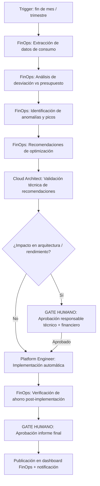

# FinOps Review Periódico

---

## 🎯 Objetivo

Mantener el control financiero de la infraestructura cloud APB mediante revisiones periódicas estructuradas. Identifica desviaciones presupuestarias, recursos subutilizados, y oportunidades de ahorro mediante Reserved Instances, rightsizing y eliminación de recursos huérfanos. Las acciones de optimización que afectan a arquitectura o rendimiento siempre requieren aprobación humana.

> **Dependencia de provider:** este workflow opera de forma completamente automatizada cuando `prov-azure-cost-v1.0` está activo. Hasta entonces, el input de costes debe proporcionarse manualmente como exportación CSV de Azure Cost Management.

## 📊 Diagrama de Flujo



## 🎭 Agentes Participantes

| Orden | Agente | Rol | Acción |
|-------|--------|-----|--------|
| 1 | FinOps | Análisis | Extracción de costes, análisis de desviación, identificación de optimizaciones |
| 2 | Cloud Architect | Validación técnica | Verificar que las optimizaciones no degradan rendimiento ni disponibilidad |
| 3 | Platform Engineer | Implementación | Aplicar optimizaciones aprobadas (rightsizing, eliminar recursos huérfanos) |

## 📡 Contratos de Output Inter-Agente

| Agente Origen | Agente Destino | Artefacto entregado | Formato |
|---------------|----------------|---------------------|---------|
| `apb-agent-finops-v1.0` | `apb-agent-cloud-architect-v1.0` | Informe de fase con hallazgos y recomendaciones | Markdown |
| `apb-agent-cloud-architect-v1.0` | `apb-agent-platform-engineer-v1.0` | Informe de fase con hallazgos y recomendaciones | Markdown |

## 📋 Fases del Workflow

### Fase 1 — Extracción de Datos de Consumo
- Agente: FinOps (vía `prov-azure-cost-v1.0` o exportación manual CSV)
- Obtener datos de consumo del periodo: mes completo (revisión mensual) o trimestre (revisión trimestral)
- Desglose por: suscripción, resource group, servicio Azure, proyecto (etiqueta `proyecto:`)
- Comparar con el presupuesto asignado por área/proyecto

### Fase 2 — Análisis de Desviación
- Agente: FinOps
- **Semáforo de desviación:**
  - 🟢 ≤5% sobre presupuesto: dentro de margen normal
  - 🟡 5-15% sobre presupuesto: alerta — investigar causa
  - 🔴 >15% sobre presupuesto: alerta crítica — acción inmediata requerida
- Identificar los 5 servicios/resource groups de mayor coste y su evolución respecto al periodo anterior
- Detectar picos de coste puntuales (posibles errores de configuración o ataques)

### Fase 3 — Identificación de Anomalías
- Agente: FinOps
- Recursos sin etiqueta `proyecto:` → imposible imputar a presupuesto → alerta a Platform Engineer
- Recursos con uso <5% en los últimos 30 días (candidatos a eliminación o rightsizing)
- VMs / App Services sobredimensionados respecto a sus métricas de CPU/memoria
- Datos en Azure Storage sin política de retención activa (coste creciente sin control)
- Reserved Instances con utilización <70% (mala inversión, evaluar reventa o cancelación)

### Fase 4 — Recomendaciones de Optimización
- Agente: FinOps
- **Tipos de optimización:**
  - **Rightsizing:** reducir SKU de VMs, App Service Plans o bases de datos sobredimensionados
  - **Reserved Instances:** comprar reservas para recursos con uso predecible ≥1 año (ahorro ~30-40%)
  - **Savings Plans:** para cargas de trabajo mixtas más flexibles que Reserved Instances
  - **Eliminación de huérfanos:** discos no asociados, IPs públicas no usadas, snapshots antiguos
  - **Storage tiering:** mover datos inactivos de Hot a Cool o Archive en Azure Blob Storage
  - **Apagado programado:** apagar entornos de dev/staging fuera del horario laboral APB (06:00-22:00 CET)

### Fase 5 — Validación Técnica
- Agente: Cloud Architect
- Revisar que las recomendaciones de rightsizing no degradan el rendimiento bajo carga real
- Verificar que los recursos candidatos a eliminación no son dependencias de otros sistemas
- Confirmar que el Storage tiering no afecta a los tiempos de acceso de aplicaciones productivas
- Validar que el apagado programado no afecta a procesos batch nocturnos

### Fase 6 — Aprobación de Optimizaciones con Impacto ⚠️ GATE HUMANO
- Las optimizaciones con impacto en arquitectura o rendimiento requieren aprobación del responsable técnico del área + responsable financiero
- Las optimizaciones sin impacto técnico (eliminar huérfanos, apagado programado de dev/staging) pueden implementarse directamente

### Fase 7 — Implementación de Optimizaciones
- Agente: Platform Engineer
- Implementar las optimizaciones aprobadas (via Terraform o Azure Portal si no hay IaC)
- Para cambios de SKU en producción → RFC en `apb-wf-change-management-v1.0`
- Para recursos en dev/staging → implementación directa con notificación al área

### Fase 8 — Verificación de Ahorro
- Agente: FinOps
- 30 días después de las implementaciones → verificar el ahorro real vs. estimado
- Ajustar las estimaciones futuras si hay desviación significativa entre lo estimado y lo real

### Fase 9 — Informe Final y Publicación
- Agente: FinOps
- Generar informe mensual/trimestral (`finops-report-YYYY-MM.md`) con:
  - Coste total del periodo vs. presupuesto
  - Top 5 servicios por coste
  - Anomalías detectadas y acciones tomadas
  - Ahorros implementados y estimados
  - Forecast para el próximo periodo
- **Gate humano:** aprobación del informe por el responsable financiero APB
- Publicar en Confluence y notificar a los responsables de área

## 📥 Input Inicial

- Periodo a analizar (mes o trimestre)
- Presupuesto asignado por suscripción/proyecto (si no está en Azure Cost Management)
- Exportación CSV de Azure Cost Management (si `prov-azure-cost-v1.0` no está activo)

## 📤 Output Final

- Informe FinOps del periodo (`finops-report-YYYY-MM.md`)
- Lista de optimizaciones implementadas con ahorro real
- Lista de optimizaciones pendientes de aprobación con estimación de ahorro
- Forecast del próximo periodo

## 🔄 Puntos de Decisión

- **DP1:** ¿La desviación es >15% del presupuesto? Si sí → notificación urgente al responsable financiero.
- **DP2:** ¿La optimización afecta a un sistema en producción? Si sí → gate humano obligatorio.
- **DP3:** ¿El ahorro real difiere >20% del estimado? Si sí → revisar el modelo de estimación FinOps.

## 🚫 Límites del Workflow

- NO puede comprar Reserved Instances sin aprobación humana (compromiso financiero a 1-3 años)
- NO puede eliminar recursos en producción sin RFC aprobado por Change Management
- NO puede modificar presupuestos asignados a áreas — esa es una decisión de dirección
- Las optimizaciones de apagado solo aplican a entornos dev/staging — nunca a producción sin análisis previo de procesos batch

## 🔒 Seguridad y Cumplimiento

- Los datos de coste son información financiera confidencial — el informe es de acceso restringido
- Uso de `prov-azure-cost-v1.0` con autenticación Managed Identity — sin credenciales en el workflow
- Los cambios de configuración en producción siguen el proceso de Change Management APB

## 🚨 Manejo de Fallos

> Documentar para cada fase qué ocurre si falla, si es bloqueante y quién decide la acción de recuperación.

| Fase | Fallo posible | ¿Bloqueante? | Acción del agente | Decisor |
|------|---------------|-------------|-------------------|---------|
| Fase 1 — Extracción de Datos de Consumo | Error técnico o datos insuficientes | Según severidad | Notificar al operador y documentar el estado alcanzado | Humano |
| Fase 2 — Análisis de Desviación | Error técnico o datos insuficientes | Según severidad | Notificar al operador y documentar el estado alcanzado | Humano |
| Fase 3 — Identificación de Anomalías | Error técnico o datos insuficientes | Según severidad | Notificar al operador y documentar el estado alcanzado | Humano |
| Fase 4 — Recomendaciones de Optimización | Error técnico o datos insuficientes | Según severidad | Notificar al operador y documentar el estado alcanzado | Humano |
| Fase 5 — Validación Técnica | Error técnico o datos insuficientes | Según severidad | Notificar al operador y documentar el estado alcanzado | Humano |
| Fase 6 — Aprobación de Optimizaciones con Impacto ⚠️ GATE HUMANO | Error técnico o datos insuficientes | Según severidad | Notificar al operador y documentar el estado alcanzado | Humano |
| Fase 7 — Implementación de Optimizaciones | Error técnico o datos insuficientes | Según severidad | Notificar al operador y documentar el estado alcanzado | Humano |
| Fase 8 — Verificación de Ahorro | Error técnico o datos insuficientes | Según severidad | Notificar al operador y documentar el estado alcanzado | Humano |
| Fase 9 — Informe Final y Publicación | Error técnico o datos insuficientes | Según severidad | Notificar al operador y documentar el estado alcanzado | Humano |

> **Principio general:** ante cualquier fallo no contemplado, el workflow se detiene, conserva el estado alcanzado y notifica al responsable humano con el contexto completo. Nunca continúa asumiendo que el fallo se resolverá solo.

## 📝 Ejemplo de Ejecución

```yaml
workflow: apb-wf-finops-review-v1.0
inputs:
  review_type: "monthly"
  period:
    start: "2026-06-01"
    end: "2026-06-29"
  subscriptions:
    - "apb-prod"
    - "apb-staging"
    - "apb-dev"
  budget_eur:
    apb-prod: 45000
    apb-staging: 8000
    apb-dev: 5000
  cost_data_source: "manual_csv"
  csv_path: "inputs/azure-cost-june-2026.csv"
```

## 🔄 Historial de Cambios

| Versión | Fecha | Autor | Cambio |
|---------|-------|-------|--------|
| 1.0.0 | 2026-06-29 | Arquitectura APB | Creación inicial — Sesión Enriquecimiento C2 |

---
*Documento generado por el APB AI Framework. Requiere revisión humana antes de aprobación.*

---

## Marcado IA obligatorio (POLICY_AI_USAGE §6)

Conforme al [`AI_MARKING_STANDARD`](../context/apb/standards/AI_MARKING_STANDARD.md), todo artefacto generado por este workflow debe incluir marca de origen IA:

- **Documentos Markdown** (informe FinOps, análisis de costes):
  > ⚠️ **Borrador generado por IA** (APB AI Framework — apb-wf-finops-review-v1.0) — pendiente validación humana. No distribuir sin revisión.
- **Commits**: prefijo `[ai-gen]` + `Co-Authored-By: APB AI Framework <framework@portdebarcelona.cat>`.
