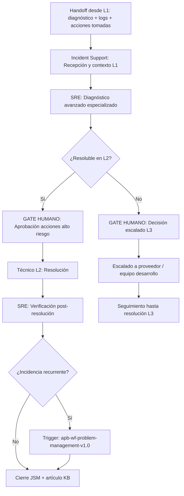

# Gestión de Incidencia L2

---

## 🎯 Objetivo

Resolver incidencias que superan la capacidad del L1 o que requieren acceso a sistemas especializados. Recibe el handoff completo de `apb-wf-incident-l1-v1.0` (diagnóstico previo, logs, acciones ya tomadas) y evita que el técnico L2 empiece desde cero. Cierra el ciclo hacia `apb-wf-problem-management-v1.0` si la incidencia es recurrente.

> **Diferencia con L1:** L1 es reactivo e inmediato (≤20 min, runbook estándar). L2 es especializado y analítico (horas, puede implicar análisis de código, configuración profunda de infraestructura o coordinación con proveedores).

## 📊 Diagrama de Flujo



## 🎭 Agentes Participantes

| Orden | Agente | Rol | Acción |
|-------|--------|-----|--------|
| 1 | Incident Support | Recepción | Procesar handoff L1, preparar contexto para el técnico L2 |
| 2 | SRE | Diagnóstico avanzado | Análisis profundo: trazas distribuidas, configuración, análisis de rendimiento |

## 📋 Fases del Workflow

### Fase 1 — Recepción del Handoff L1
- Agente: Incident Support
- Procesar el paquete de handoff L1: prioridad, síntoma, diagnóstico previo, logs, acciones ya tomadas y su resultado
- Presentar al técnico L2 un resumen ejecutivo con lo ya intentado para evitar repetición
- Verificar que el ticket JSM refleja el estado actual (actualizado por L1)
- **El técnico L2 es notificado automáticamente vía Teams** con el resumen del handoff

### Fase 2 — Diagnóstico Avanzado
- Agente: SRE
- Análisis más profundo que L1, con acceso a herramientas especializadas:
  - **Azure Application Insights** — trazas distribuidas, excepciones, dependencias lentas
  - **Azure Monitor Workbooks** — correlación multi-servicio
  - **Log Analytics KQL** — queries complejas sobre múltiples tablas
  - **Grafana APB** — dashboards de SLO y métricas de rendimiento
  - **Oracle Enterprise Manager** — análisis de rendimiento de BD Oracle
- Hipótesis de causa raíz con nivel de confianza y pasos de verificación
- **Si confianza <60%:** presentar las 3 hipótesis más probables sin recomendar una sola

### Fase 3 — Aprobación de Acciones de Alto Riesgo ⚠️ GATE HUMANO
- El técnico L2 revisa las acciones propuestas
- **Acciones que SIEMPRE requieren confirmación humana explícita:**
  - Reinicio de servicios críticos en producción (servicios con SLA P1/P2)
  - Kill de sesiones en base de datos Oracle
  - Modificación de configuración de red (firewall, NSG, DNS)
  - Rollback de despliegue en producción
  - Escalado a proveedor externo (implica costes y SLA externos)

### Fase 4 — Resolución (ejecución humana)
- El técnico L2 aplica las acciones aprobadas
- El agente SRE monitoriza métricas en tiempo real durante la resolución
- El técnico L2 registra en JSM cada paso y su resultado

### Fase 5 — Verificación Post-Resolución
- Agente: SRE
- Verificar criterios de resolución definidos en el diagnóstico
- Monitorización activa durante ≥30 minutos post-resolución para detectar recaída
- Si la incidencia reaparece en <2h → escalar a L3 directamente

### Fase 6 — Cierre y Gestión de Recurrencia
- Si es la 2ª o más incidencia del mismo tipo en 30 días → trigger automático a `apb-wf-problem-management-v1.0`
- Generar artículo KB en Confluence con el diagnóstico y resolución (para que L1 pueda resolverlo en el futuro)
- Cerrar ticket JSM con causa raíz, acciones y SLA cumplido/incumplido

### Fase 7 — Escalado L3 *(si aplica)*
- **Gate humano:** el responsable del servicio debe aprobar el escalado a L3 (proveedor externo o equipo de desarrollo)
- El agente prepara el paquete de escalado completo: contexto, diagnóstico L1+L2, acciones tomadas, logs relevantes, impacto
- Seguimiento del ticket con el proveedor hasta resolución

## 📥 Input Inicial

- Paquete de handoff L1 completo:
  - Ticket JSM con historial de acciones L1
  - Diagnóstico L1 (árbol de causas, hipótesis, confianza)
  - Logs y evidencias recopiladas
  - Acciones ya ejecutadas y su resultado
  - Razón del escalado (capacidad L1 superada / herramientas insuficientes / acceso no autorizado para L1)

## 📤 Output Final

- Ticket JSM cerrado con resolución L2 documentada
- Artículo KB en Confluence para que L1 pueda resolver casos similares
- Trigger a `apb-wf-problem-management-v1.0` si es incidencia recurrente
- Paquete de escalado L3 (si se escaló a proveedor)

## 🔄 Puntos de Decisión

- **DP1:** ¿La hipótesis de diagnóstico L2 confirma o contradice la de L1? Documentar en JSM.
- **DP2:** ¿La resolución requiere acceso L3 (código fuente, infraestructura de proveedor)? Si sí → escalado.
- **DP3:** ¿La incidencia es recurrente (≥2 en 30 días)? Si sí → Problem Management.

## 🚫 Límites del Workflow

- NO puede ejecutar acciones en producción — el técnico L2 siempre es quien ejecuta
- NO puede aprobar su propio escalado a L3 (autonomía nivel 1)
- NO reemplaza a L1 — asume que el triaje y diagnóstico inicial ya están hechos
- NO gestiona incidencias de seguridad (ciberincidentes) — derivar al proceso CSIRT APB

## 🔒 Seguridad y Cumplimiento

- El paquete de handoff L1 no debe incluir credenciales — usar referencias a Key Vault APB
- Los logs de producción manejados durante el diagnóstico se tratan con confidencialidad y no se almacenan en el repositorio
- Las acciones de alto riesgo quedan registradas en el ticket JSM con timestamp y confirmación del técnico responsable

## 🚨 Manejo de Fallos

> Documentar para cada fase qué ocurre si falla, si es bloqueante y quién decide la acción de recuperación.

| Fase | Fallo posible | ¿Bloqueante? | Acción del agente | Decisor |
|------|---------------|-------------|-------------------|---------|
| Fase 1 — Recepción del Handoff L1 | Error técnico o datos insuficientes | Según severidad | Notificar al operador y documentar el estado alcanzado | Humano |
| Fase 2 — Diagnóstico Avanzado | Error técnico o datos insuficientes | Según severidad | Notificar al operador y documentar el estado alcanzado | Humano |
| Fase 3 — Aprobación de Acciones de Alto Riesgo ⚠️ GATE HUMANO | Error técnico o datos insuficientes | Según severidad | Notificar al operador y documentar el estado alcanzado | Humano |
| Fase 4 — Resolución (ejecución humana) | Error técnico o datos insuficientes | Según severidad | Notificar al operador y documentar el estado alcanzado | Humano |
| Fase 5 — Verificación Post-Resolución | Error técnico o datos insuficientes | Según severidad | Notificar al operador y documentar el estado alcanzado | Humano |
| Fase 6 — Cierre y Gestión de Recurrencia | Error técnico o datos insuficientes | Según severidad | Notificar al operador y documentar el estado alcanzado | Humano |
| Fase 7 — Escalado L3 *(si aplica)* | Error técnico o datos insuficientes | Según severidad | Notificar al operador y documentar el estado alcanzado | Humano |

> **Principio general:** ante cualquier fallo no contemplado, el workflow se detiene, conserva el estado alcanzado y notifica al responsable humano con el contexto completo. Nunca continúa asumiendo que el fallo se resolverá solo.

## 📝 Ejemplo de Ejecución

```yaml
workflow: apb-wf-incident-l2-v1.0
inputs:
  escalation_from: "apb-wf-incident-l1-v1.0"
  jira_ticket: "INC-2026-0615"
  priority: "P2"
  symptom: "Latencia >10s en API de atraques — timeout en el 30% de las peticiones"
  l1_diagnosis: "Probable saturación de connection pool Oracle (85% confianza)"
  l1_actions_taken:
    - "Reinicio del App Pool IIS — sin mejora"
    - "Verificación de tablespaces Oracle — OK"
  escalation_reason: "Acceso a AWR/ASH de Oracle para análisis de rendimiento no disponible para L1"
  logs_attached: ["application-insights-export.json", "oracle-alert-log.txt"]
```

## 🔄 Historial de Cambios

| Versión | Fecha | Autor | Cambio |
|---------|-------|-------|--------|
| 1.0.0 | 2026-06-29 | Arquitectura APB | Creación inicial — Sesión Enriquecimiento C2 |

---
*Documento generado por el APB AI Framework. Requiere revisión humana antes de aprobación.*

---

## Marcado IA obligatorio (POLICY_AI_USAGE §6)

Conforme al [`AI_MARKING_STANDARD`](../context/apb/standards/AI_MARKING_STANDARD.md), todo artefacto generado por este workflow debe incluir marca de origen IA:

- **Documentos Markdown** (diagnóstico L2, artículo KB):
  > ⚠️ **Borrador generado por IA** (APB AI Framework — apb-wf-incident-l2-v1.0) — pendiente validación humana. No distribuir sin revisión.
- **Tickets Jira/JSM**: label `ia-generado` + footer en descripción.
- **Commits**: prefijo `[ai-gen]` + `Co-Authored-By: APB AI Framework <framework@portdebarcelona.cat>`.
