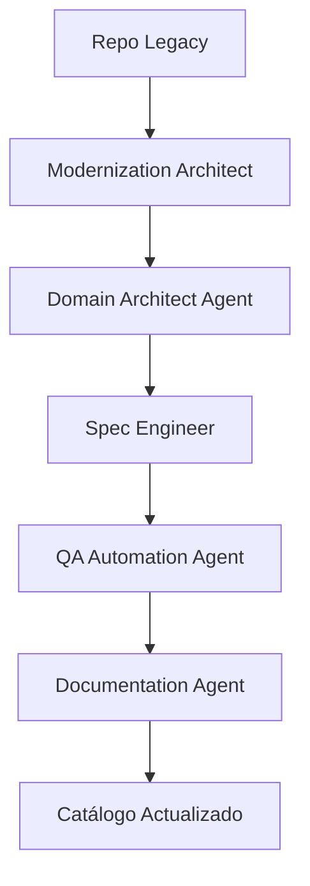

# Legacy Onboarding

---

## 🎯 Objetivo

Onboardar repositorios existentes sin especificaciones formales al framework APB. Generar documentación de descubrimiento, especificaciones técnicas, y backlog inicial para la modernización del sistema legacy.

## 📊 Diagrama de Flujo



## 🎭 Agentes Participantes

| Orden | Agente | Rol | Skills Utilizadas |
|-------|--------|-----|-------------------|
| 1 | Modernization Architect | Análisis de código legacy | `apb-disc-reverse-code`, `apb-disc-ddd-legacy` |
| 2 | Domain Architect Agent | Modelado de dominio DDD | `apb-arch-ddd`, `apb-arch-event-storming` |
| 3 | Spec Engineer | Generación de especificaciones | `apb-disc-spec-gen`, `apb-disc-backlog` |
| 4 | QA Automation Agent | Validación post-análisis | `apb-qa-test-strategy`, `apb-qa-anonymize` |
| 5 | Documentation Agent | Documentación del onboarding | `apb-doc-adr`, `apb-gov-evidence` |

## 📡 Contratos de Output Inter-Agente

| Agente Origen | Agente Destino | Artefacto entregado | Formato |
|---------------|----------------|---------------------|---------|
| `apb-agent-modernization-v1.0` | `apb-agent-domain-architect-v1.0` | Informe de fase con hallazgos y recomendaciones | Markdown |
| `apb-agent-domain-architect-v1.0` | `apb-agent-spec-engineer-v1.0` | Informe de fase con hallazgos y recomendaciones | Markdown |
| `apb-agent-spec-engineer-v1.0` | `apb-agent-qa-auto-v1.0` | Informe de fase con hallazgos y recomendaciones | Markdown |
| `apb-agent-qa-auto-v1.0` | `apb-agent-documentation-v1.0` | Informe de fase con hallazgos y recomendaciones | Markdown |

## 📋 Fases del Workflow

### Fase 1: Análisis de Código Legacy (Modernization Architect)
- Ingeniería inversa desde código fuente
- Identificación de deuda técnica y dependencias
- Generación de mapa de calor de complejidad

### Fase 2: Modelado de Dominio (Domain Architect Agent)
- Sesión de Event Storming con stakeholders
- Identificación de bounded contexts
- Generación de context map

### Fase 3: Generación de Especificaciones (Spec Engineer)
- Creación de `system-spec.md` desde código
- Generación de backlog ágil inicial
- Estimación COSMIC Function Points

### Fase 4: Validación QA (QA Automation Agent)
- Definición de estrategia de testing
- Generación de datos de prueba anonimizados
- Preparación de plan de validación post-migración

### Fase 5: Documentación y Gobierno (Documentation Agent)
- Generación de ADRs para decisiones de modernización
- Registro de evidencias en Jira
- Actualización del catálogo APB

## 📥 Input Inicial

- Repositorio de código legacy
- Acceso a base de datos legacy (esquema)
- Stakeholders disponibles para Event Storming
- Contexto de negocio y alcance de modernización

## 📤 Output Final

- Documento de descubrimiento completo (`business-discovery.md`)
- Especificación técnica (`system-spec.md`)
- Backlog ágil inicial con épicas e historias
- Modelo de dominio DDD (`ddd-model.md`)
- ADRs de decisiones de modernización
- Catálogo APB actualizado

## 🔄 Puntos de Decisión

- **DP1:** ¿El código legacy es suficientemente comprensible para ingeniería inversa? Si no, requiere entrevistas adicionales.
- **DP2:** ¿Los bounded contexts identificados son viables para descomposición? Si no, iterar con Domain Architect.
- **DP3:** ¿La estimación COSMIC es aceptable para stakeholders? Si no, renegociar alcance.
- **DP4:** ¿Las especificaciones generadas son completas? Requiere validación humana antes de aprobar.

## 🚫 Límites y Escapes

- Este workflow NO modifica código legacy directamente
- NO puede saltar la fase de validación humana
- Las especificaciones generadas son propuestas (draft)
- Requiere aprobación de Governance Agent antes de pasar a implementación

## 🔒 Seguridad y Cumplimiento

- Anonimización de datos de producción antes de análisis
- No exposición de vulnerabilidades legacy públicamente
- Uso de Azure Key Vault para credenciales de repositorios
- Cumplimiento con políticas de retención de datos

## 🚨 Manejo de Fallos

> Documentar para cada fase qué ocurre si falla, si es bloqueante y quién decide la acción de recuperación.

| Fase | Fallo posible | ¿Bloqueante? | Acción del agente | Decisor |
|------|---------------|-------------|-------------------|---------|
| Fase 1: Análisis de Código Legacy (Modernization Architect) | Error técnico o datos insuficientes | Según severidad | Notificar al operador y documentar el estado alcanzado | Humano |
| Fase 2: Modelado de Dominio (Domain Architect Agent) | Error técnico o datos insuficientes | Según severidad | Notificar al operador y documentar el estado alcanzado | Humano |
| Fase 3: Generación de Especificaciones (Spec Engineer) | Error técnico o datos insuficientes | Según severidad | Notificar al operador y documentar el estado alcanzado | Humano |
| Fase 4: Validación QA (QA Automation Agent) | Error técnico o datos insuficientes | Según severidad | Notificar al operador y documentar el estado alcanzado | Humano |
| Fase 5: Documentación y Gobierno (Documentation Agent) | Error técnico o datos insuficientes | Según severidad | Notificar al operador y documentar el estado alcanzado | Humano |

> **Principio general:** ante cualquier fallo no contemplado, el workflow se detiene, conserva el estado alcanzado y notifica al responsable humano con el contexto completo. Nunca continúa asumiendo que el fallo se resolverá solo.

## 📝 Ejemplo de Ejecución

```yaml
workflow: apb-wf-legacy-onboarding-v1.0
inputs:
  workflow: "apb-wf-legacy-onboarding-v1.0"
  inputs:
    legacy_repo: "/repos/legacy-system"
    legacy_database:
      connection_string: "ref:akv/legacy-db-conn"
      schema_only: true
    business_context: "Gestión Tributaria Municipal"
    stakeholders:
      - "Jefe de Servicio"
      - "Analista Funcional Legacy"
    modernization_scope:
      - "Módulo Tributos"
      - "Módulo Parcelas"
    output_format: "onboarding-package"
```

## 🔄 Historial de Cambios

| Versión | Fecha | Autor | Cambio |
|---------|-------|-------|--------|
| 1.0.0 | 2026-06-21 | Arquitectura APB | Creación inicial |

---
*Documento generado por el APB AI Framework. Requiere revisión humana antes de aprobación.*
