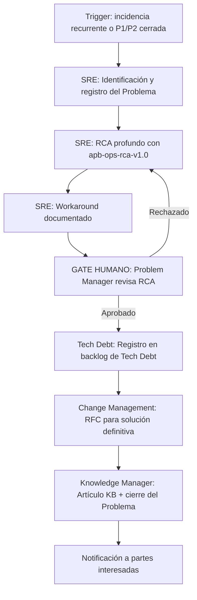

# Problem Management

---

## 🎯 Objetivo

Transformar incidencias recurrentes o de alta severidad en mejoras sistémicas. Cuando `apb-wf-incident-l1-v1.0` detecta un patrón de recurrencia (≥2 incidencias similares en 30 días) o se cierra una incidencia P1/P2, este workflow arranca para garantizar que el conocimiento llega a la base de conocimiento (KB) y la causa raíz sistémica se elimina mediante un cambio estructural registrado en el backlog de Tech Debt.

## 📊 Diagrama de Flujo



## 🎭 Agentes Participantes

| Orden | Agente | Rol | Acción |
|-------|--------|-----|--------|
| 1 | SRE Agent | Análisis | Registrar el problema, ejecutar RCA profundo, documentar workaround |
| 2 | Tech Debt Agent | Registro | Crear epic en Jira Software con la solución definitiva como deuda técnica |
| 3 | Knowledge Manager | Documentación | Publicar artículo en KB Confluence y cerrar el problema formalmente |

## 📋 Fases del Workflow

### Fase 1 — Identificación y Registro del Problema
- Agente: SRE
- Trigger automático desde `apb-wf-incident-l1-v1.0` (recurrencia ≥2 en 30 días) o manual post-P1/P2
- Registro del ticket de Problema en JSM: descripción, incidencias vinculadas, impacto acumulado
- El Problema queda en estado **Identificado**

### Fase 2 — RCA Profundo
- Agente: SRE (invoca `apb-ops-rca-v1.0`)
- 5 Whys, Ishikawa/Fishbone, Fault Tree Analysis
- Timeline completo de todas las incidencias relacionadas
- Identificación de causa raíz sistémica (no síntomas)
- El Problema pasa a estado **Análisis en curso**

### Fase 3 — Workaround
- Agente: SRE
- Si existe workaround (aunque sea temporal): documentarlo en el ticket de Problema y en la KB
- El workaround evita que futuras incidencias del mismo tipo escalen — L1 puede resolverlo directamente
- El Problema pasa a estado **Workaround identificado**

### Fase 4 — Aprobación del RCA ⚠️ GATE HUMANO
- Responsable: Problem Manager (persona humana del equipo de operaciones APB)
- Revisa que el RCA es correcto y completo (causa raíz claramente identificada, no es un síntoma)
- Aprueba o rechaza el Plan de Solución Definitiva propuesto por el SRE Agent
- Si rechazado → volver a Fase 2 con los comentarios del Problem Manager

### Fase 5 — Registro en Backlog de Tech Debt
- Agente: Tech Debt (vía `prov-jira-software-v1.0`)
- Crear epic en Jira Software con la solución definitiva como deuda técnica priorizada
- Vincular el epic al ticket de Problema JSM
- El Problema pasa a estado **Solución en planificación**

### Fase 6 — Cambio a Change Management
- Si la solución definitiva requiere un cambio en producción → iniciar `apb-wf-change-management-v1.0`
- El RFC referencia el ticket de Problema para trazabilidad ITIL completa
- El Problema permanece abierto hasta que el RFC se cierre con éxito

### Fase 7 — Cierre y Publicación en KB
- Agente: Knowledge Manager
- Publicar artículo en Confluence KB con: descripción del problema, causa raíz, solución aplicada, workaround temporal (si quedó pendiente de algún sistema)
- Actualizar la sección de incidencias del L1 para que el workaround sea visible en futuros diagnósticos
- El Problema pasa a estado **Cerrado** (requiere confirmación humana del Problem Manager)

## 📥 Input Inicial

- Referencia a las incidencias relacionadas (IDs de tickets JSM)
- Descripción del patrón de recurrencia o del impacto del P1/P2
- Logs y evidencias recopiladas durante las incidencias (input para el RCA)

## 📤 Output Final

- Ticket de Problema JSM cerrado con causa raíz documentada
- Epic de Tech Debt en Jira Software con solución definitiva planificada
- Artículo KB en Confluence disponible para el equipo L1
- RFC generado en `apb-wf-change-management-v1.0` (si procede)

## 🔄 Puntos de Decisión

- **DP1:** ¿Se identifica causa raíz sistémica o es un problema de configuración puntual? Determina si se necesita RFC o solo configuración.
- **DP2:** ¿El Problem Manager aprueba el RCA? Si no, volver a análisis.
- **DP3:** ¿La solución definitiva requiere cambio en producción? Si sí → `apb-wf-change-management-v1.0`.

## 🚫 Límites del Workflow

- NO sustituye a `apb-wf-incident-l1-v1.0` — el incidente debe estar resuelto antes de abrir el Problema
- NO puede cerrar el Problema sin aprobación humana del Problem Manager
- NO puede modificar directamente sistemas en producción — todo cambio va por Change Management
- Los problemas de seguridad (CVEs, vulnerabilidades) van por `apb-wf-security-patch-v1.0`, no por este workflow

## 🔒 Seguridad y Cumplimiento

- El RCA no incluye datos personales de usuarios afectados — trabaja con volúmenes e impacto agregado
- El artículo KB sigue las políticas de clasificación de información APB
- Trazabilidad ITIL completa: Incidencia → Problema → RFC → Cambio aplicado

## 📝 Ejemplo de Ejecución

```yaml
workflow: apb-wf-problem-management-v1.0
inputs:
  trigger: "recurrence"
  related_incidents:
    - "INC-2026-0412"
    - "INC-2026-0501"
    - "INC-2026-0615"
  pattern_description: "Caída del servicio de pagos por deadlock en BD — 3 incidencias en 60 días"
  cumulative_impact: "23 + 18 + 31 minutos de interrupción, ~150 usuarios afectados por incidencia"
```

## 🔄 Historial de Cambios

| Versión | Fecha | Autor | Cambio |
|---------|-------|-------|--------|
| 1.0.0 | 2026-06-29 | Arquitectura APB | Creación inicial — Sesión Enriquecimiento C2 |

---
*Documento generado por el APB AI Framework. Requiere revisión humana antes de aprobación.*

---

## Marcado IA obligatorio (POLICY_AI_USAGE §6)

Conforme al [`AI_MARKING_STANDARD`](../context/apb/standards/AI_MARKING_STANDARD.md), todo artefacto generado por este workflow debe incluir marca de origen IA:

- **Documentos Markdown** (informe RCA, artículo KB):
  > ⚠️ **Borrador generado por IA** (APB AI Framework — apb-wf-problem-management-v1.0) — pendiente validación humana. No distribuir sin revisión.
- **Tickets Jira/JSM**: label `ia-generado` + footer en descripción.
- **Commits**: prefijo `[ai-gen]` + `Co-Authored-By: APB AI Framework <framework@portdebarcelona.cat>`.
