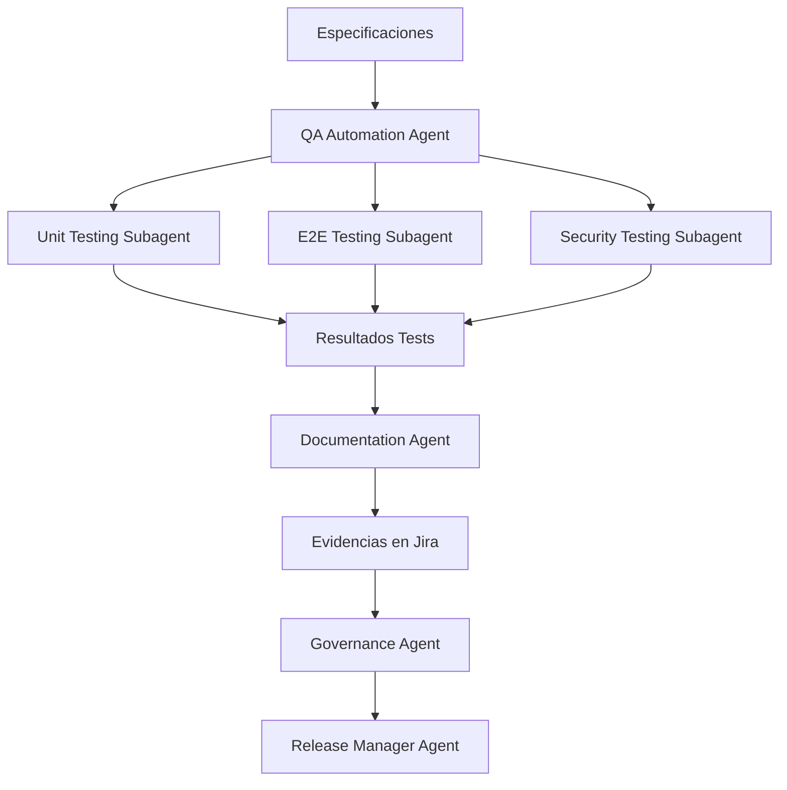

# QA & Evidence

---

## 🎯 Objetivo

Generar plan de pruebas completo, ejecutar tests automatizados, y documentar todas las evidencias de calidad para cumplimiento y auditoría.

## 📊 Diagrama de Flujo



## 🎭 Agentes Participantes

| Orden | Agente | Rol | Skills Utilizadas |
|-------|--------|-----|-------------------|
| 1 | QA Automation Agent | Planificación y coordinación QA | `apb-qa-test-plan`, `apb-qa-test-strategy` |
| 2 | Unit Testing Subagent | Tests unitarios y cobertura | `apb-qa-unit-test-gen` |
| 3 | E2E Testing Subagent | Tests end-to-end | `apb-qa-test-auto` |
| 4 | Security Testing Subagent | Tests de seguridad | `apb-dev-openspec-review`, `apb-sec-owasp` |
| 5 | Documentation Agent | Documentación de evidencias | `apb-gov-evidence`, `apb-gov-jira-evidence` |
| 6 | Governance Agent | Validación de cumplimiento | `apb-gov-compliance` |
| 7 | Release Manager Agent | Decisión de release | `apb-qa-release-ready` |

## 📡 Contratos de Output Inter-Agente

| Agente Origen | Agente Destino | Artefacto entregado | Formato |
|---------------|----------------|---------------------|---------|
| `apb-agent-qa-auto-v1.0` | `apb-agent-documentation-v1.0` | Informe de fase con hallazgos y recomendaciones | Markdown |
| `apb-agent-documentation-v1.0` | `apb-agent-governance-v1.0` | Informe de fase con hallazgos y recomendaciones | Markdown |
| `apb-agent-governance-v1.0` | `apb-agent-release-manager-v1.0` | Informe de fase con hallazgos y recomendaciones | Markdown |

## 📋 Fases del Workflow

### Fase 1: Planificación QA
- Generación de plan de pruebas desde especificaciones
- Definición de estrategia de testing
- Preparación de datos de prueba anonimizados

### Fase 2: Testing Unitario
- Generación de tests unitarios con cobertura ≥ 80%
- Ejecución y análisis de resultados
- Reporte de fallos y trazabilidad

### Fase 3: Testing E2E
- Automatización de flujos funcionales críticos
- Ejecución en múltiples navegadores
- Generación de evidencias visuales

### Fase 4: Testing de Seguridad
- Análisis estático con SonarQube
- Escaneo dinámico con OWASP ZAP
- Validación de vulnerabilidades

### Fase 5: Documentación de Evidencias
- Consolidación de resultados de testing
- Registro de evidencias en Jira
- Generación de informe de calidad

### Fase 6: Validación de Gobierno
- Validación de cumplimiento arquitectónico
- Verificación de estándares corporativos

### Fase 7: Decisión de Release
- Evaluación de readiness para release
- Decisión de go/no-go

## 📥 Input Inicial

- Especificaciones funcionales y técnicas
- Código fuente del sistema
- Ambientes de prueba disponibles
- Datos de producción anonimizados
- Credenciales de test (AKV reference)

## 📤 Output Final

- Plan de pruebas ejecutado
- Suite de tests automatizados
- Informe de cobertura de código ≥ 80%
- Evidencias de testing registradas en Jira
- Informe de calidad y seguridad
- Decisión de readiness para release

## 🔄 Puntos de Decisión

- **DP1:** ¿La cobertura de tests unitarios es ≥ 80%? Si no, requiere más tests.
- **DP2:** ¿Los tests E2E pasan en todos los navegadores? Si no, investigar fallos.
- **DP3:** ¿Hay vulnerabilidades críticas o altas? Si sí, bloquear release.
- **DP4:** ¿Las evidencias están completas en Jira? Si no, completar antes de release.
- **DP5:** ¿Decisión de go/no-go? Requiere aprobación humana.

## 🚫 Límites y Escapes

- NO puede aprobar release sin evidencias completas
- NO puede ignorar vulnerabilidades críticas
- Los tests deben ser ejecutados en ambientes aislados
- Requiere validación humana para decisiones de release

## 🔒 Seguridad y Cumplimiento

- Anonimización de datos de prueba
- Aislamiento de ambientes de prueba
- No exposición de vulnerabilidades en documentación pública
- Uso de Azure Key Vault para credenciales
- Auditoría de evidencias

## 🚨 Manejo de Fallos

> Documentar para cada fase qué ocurre si falla, si es bloqueante y quién decide la acción de recuperación.

| Fase | Fallo posible | ¿Bloqueante? | Acción del agente | Decisor |
|------|---------------|-------------|-------------------|---------|
| Fase 1: Planificación QA | Error técnico o datos insuficientes | Según severidad | Notificar al operador y documentar el estado alcanzado | Humano |
| Fase 2: Testing Unitario | Error técnico o datos insuficientes | Según severidad | Notificar al operador y documentar el estado alcanzado | Humano |
| Fase 3: Testing E2E | Error técnico o datos insuficientes | Según severidad | Notificar al operador y documentar el estado alcanzado | Humano |
| Fase 4: Testing de Seguridad | Error técnico o datos insuficientes | Según severidad | Notificar al operador y documentar el estado alcanzado | Humano |
| Fase 5: Documentación de Evidencias | Error técnico o datos insuficientes | Según severidad | Notificar al operador y documentar el estado alcanzado | Humano |
| Fase 6: Validación de Gobierno | Error técnico o datos insuficientes | Según severidad | Notificar al operador y documentar el estado alcanzado | Humano |
| Fase 7: Decisión de Release | Error técnico o datos insuficientes | Según severidad | Notificar al operador y documentar el estado alcanzado | Humano |

> **Principio general:** ante cualquier fallo no contemplado, el workflow se detiene, conserva el estado alcanzado y notifica al responsable humano con el contexto completo. Nunca continúa asumiendo que el fallo se resolverá solo.

## 📝 Ejemplo de Ejecución

```yaml
workflow: apb-wf-qa-evidence-v1.0
inputs:
  workflow: "apb-wf-qa-evidence-v1.0"
  inputs:
    system_spec: "system-spec.md"
    source_code_path: "/repos/project/src"
    test_levels:
      - "unit"
      - "integration"
      - "e2e"
      - "security"
    coverage_threshold: 80
    jira_project_key: "TRIB"
    environments:
      dev: "https://dev.project.apb.es"
      staging: "https://staging.project.apb.es"
    output_format: "qa-evidence-package"
```

## 🔄 Historial de Cambios

| Versión | Fecha | Autor | Cambio |
|---------|-------|-------|--------|
| 1.0.0 | 2026-06-21 | Arquitectura APB | Creación inicial |

---
*Documento generado por el APB AI Framework. Requiere revisión humana antes de aprobación.*
