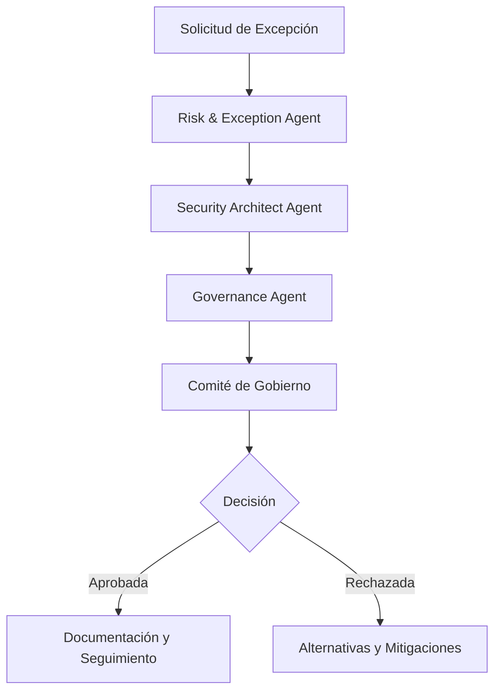

# Risk & Exception

---

## 🎯 Objetivo

Gestionar excepciones a estándares y políticas con análisis de riesgo completo, mitigaciones propuestas, y documentación de aceptación de riesgo.

## 📊 Diagrama de Flujo



## 🎭 Agentes Participantes

| Orden | Agente | Rol | Skills Utilizadas |
|-------|--------|-----|-------------------|
| 1 | Risk & Exception Agent | Análisis de riesgo inicial | `apb-sec-risk-analysis`, `apb-sec-risk-policies` |
| 2 | Security Architect Agent | Validación de impacto de seguridad | `apb-sec-threat-model`, `apb-sec-ens`, `apb-sec-owasp` |
| 3 | Governance Agent | Validación de cumplimiento y estándares | `apb-gov-compliance`, `apb-gov-policy-check`, `apb-gov-standards` |
| 4 | Comité de Gobierno | Decisión de aprobación/rechazo | — |
| 5 | Documentation Agent | Documentación de decisión | `apb-gov-evidence`, `apb-doc-adr` |

## 📡 Contratos de Output Inter-Agente

| Agente Origen | Agente Destino | Artefacto entregado | Formato |
|---------------|----------------|---------------------|---------|
| `apb-agent-risk-exception-v1.0` | `apb-agent-security-architect-v1.0` | Informe de fase con hallazgos y recomendaciones | Markdown |
| `apb-agent-security-architect-v1.0` | `apb-agent-governance-v1.0` | Informe de fase con hallazgos y recomendaciones | Markdown |
| `apb-agent-governance-v1.0` | `apb-agent-documentation-v1.0` | Informe de fase con hallazgos y recomendaciones | Markdown |

## 📋 Fases del Workflow

### Fase 1: Solicitud de Excepción
- Recepción de solicitud con justificación
- Identificación de estándar/política afectada
- Contexto de negocio y urgency

### Fase 2: Análisis de Riesgo
- Análisis cuantitativo y cualitativo
- Identificación de impactos potenciales
- Evaluación de alternativas

### Fase 3: Validación de Seguridad
- Impacto en threat model
- Validación contra ENS/OWASP
- Identificación de nuevos riesgos de seguridad

### Fase 4: Validación de Gobierno
- Verificación de cumplimiento con estándares
- Evaluación de precedentes
- Recomendación de aprobación/rechazo

### Fase 5: Decisión del Comité
- Revisión por comité de gobierno
- Decisión de aprobación con condiciones o rechazo
- Documentación de decisión

### Fase 6: Seguimiento
- Implementación de mitigaciones aprobadas
- Monitoreo de riesgo residual
- Revisión periódica de excepciones activas

## 📥 Input Inicial

- Solicitud de excepción con justificación detallada
- Estándar o política afectada
- Contexto de negocio y urgency
- Alternativas evaluadas por solicitante
- Impacto técnico y de negocio

## 📤 Output Final

- Análisis de riesgo completo
- Recomendación de aprobación/rechazo
- Plan de mitigación (si aprobada)
- Documento de aceptación de riesgo
- Seguimiento de excepción activa
- ADRs de decisiones de excepción

## 🔄 Puntos de Decisión

- **DP1:** ¿El análisis de riesgo es completo? Si no, solicitar más información.
- **DP2:** ¿Hay alternativas viables sin excepción? Si sí, recomendar alternativa.
- **DP3:** ¿El impacto de seguridad es aceptable? Si no, rechazar.
- **DP4:** ¿La decisión del comité es aprobación? Si sí, definir condiciones y fecha de revisión.
- **DP5:** ¿La excepción requiere revisión periódica? Sí, todas las excepciones tienen fecha de caducidad.

## 🚫 Límites y Escapes

- NO puede aprobar excepciones sin comité de gobierno
- NO puede ignorar riesgos críticos de seguridad
- Todas las excepciones deben tener fecha de caducidad
- Requiere documentación completa de decisión

## 🔒 Seguridad y Cumplimiento

- Confidencialidad de análisis de riesgos
- No divulgación de vulnerabilidades en justificaciones
- Uso de Azure Key Vault para datos sensibles
- Auditoría de decisiones de excepción
- Trazabilidad completa

## 🚨 Manejo de Fallos

> Documentar para cada fase qué ocurre si falla, si es bloqueante y quién decide la acción de recuperación.

| Fase | Fallo posible | ¿Bloqueante? | Acción del agente | Decisor |
|------|---------------|-------------|-------------------|---------|
| Fase 1: Solicitud de Excepción | Error técnico o datos insuficientes | Según severidad | Notificar al operador y documentar el estado alcanzado | Humano |
| Fase 2: Análisis de Riesgo | Error técnico o datos insuficientes | Según severidad | Notificar al operador y documentar el estado alcanzado | Humano |
| Fase 3: Validación de Seguridad | Error técnico o datos insuficientes | Según severidad | Notificar al operador y documentar el estado alcanzado | Humano |
| Fase 4: Validación de Gobierno | Error técnico o datos insuficientes | Según severidad | Notificar al operador y documentar el estado alcanzado | Humano |
| Fase 5: Decisión del Comité | Error técnico o datos insuficientes | Según severidad | Notificar al operador y documentar el estado alcanzado | Humano |
| Fase 6: Seguimiento | Error técnico o datos insuficientes | Según severidad | Notificar al operador y documentar el estado alcanzado | Humano |

> **Principio general:** ante cualquier fallo no contemplado, el workflow se detiene, conserva el estado alcanzado y notifica al responsable humano con el contexto completo. Nunca continúa asumiendo que el fallo se resolverá solo.

## 📝 Ejemplo de Ejecución

```yaml
workflow: apb-wf-risk-exception-v1.0
inputs:
  workflow: "apb-wf-risk-exception-v1.0"
  inputs:
    exception_request:
      standard: "apb-coding-standards-v2.1"
      rule: "max-method-length"
      justification: "Legacy code requires gradual refactoring"
      requested_by: "Tech Lead"
      project: "Modernización Tributaria"
      urgency: "high"
    alternatives:
      - "Complete refactor (high cost, 3 sprints)"
      - "Wrapper pattern (medium cost, 1 sprint)"
    output_format: "risk-exception-package"
```

## 🔄 Historial de Cambios

| Versión | Fecha | Autor | Cambio |
|---------|-------|-------|--------|
| 1.0.0 | 2026-06-21 | Arquitectura APB | Creación inicial |

---
*Documento generado por el APB AI Framework. Requiere revisión humana antes de aprobación.*
