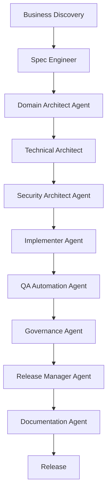

# Spec Driven Development

---

## 🎯 Objetivo

Ciclo completo de desarrollo dirigido por especificaciones, desde el descubrimiento de negocio hasta el release, integrando todos los agentes del framework APB.

## 📊 Diagrama de Flujo



## 🎭 Agentes Participantes

| Orden | Agente | Rol | Skills Utilizadas |
|-------|--------|-----|-------------------|
| 1 | Business Analyst Agent | Descubrimiento de negocio | `apb-disc-business`, `apb-disc-enrich-req` |
| 2 | Spec Engineer | Especificaciones y backlog | `apb-disc-spec-gen`, `apb-disc-backlog`, `apb-disc-cosmic` |
| 3 | Domain Architect Agent | Modelado DDD | `apb-arch-ddd`, `apb-arch-event-storming` |
| 4 | Technical Architect | Diseño técnico | `apb-arch-design`, `apb-arch-api-contract`, `apb-arch-tech-plan` |
| 5 | Security Architect Agent | Seguridad por diseño | `apb-sec-threat-model`, `apb-sec-ens`, `apb-sec-owasp` |
| 6 | Implementer Agent | Implementación de código | `apb-dev-implement`, `apb-dev-code-review`, `apb-dev-pr-doc` |
| 7 | QA Automation Agent | Testing y calidad | `apb-qa-test-plan`, `apb-qa-test-auto`, `apb-qa-unit-test-gen` |
| 8 | Governance Agent | Validación de gobierno | `apb-gov-compliance`, `apb-gov-standards`, `apb-gov-policy-check` |
| 9 | Release Manager Agent | Coordinación de release | `apb-qa-release-ready` |
| 10 | Documentation Agent | Documentación final | `apb-doc-adr`, `apb-doc-swagger`, `apb-doc-manual` |

## 📡 Contratos de Output Inter-Agente

| Agente Origen | Agente Destino | Artefacto entregado | Formato |
|---------------|----------------|---------------------|---------|
| `apb-agent-business-analyst-v1.0` | `apb-agent-spec-engineer-v1.0` | Informe de fase con hallazgos y recomendaciones | Markdown |
| `apb-agent-spec-engineer-v1.0` | `apb-agent-domain-architect-v1.0` | Informe de fase con hallazgos y recomendaciones | Markdown |
| `apb-agent-domain-architect-v1.0` | `apb-agent-technical-architect-v1.0` | Informe de fase con hallazgos y recomendaciones | Markdown |
| `apb-agent-technical-architect-v1.0` | `apb-agent-security-architect-v1.0` | Informe de fase con hallazgos y recomendaciones | Markdown |
| `apb-agent-security-architect-v1.0` | `apb-agent-implementer-v1.0` | Informe de fase con hallazgos y recomendaciones | Markdown |
| `apb-agent-implementer-v1.0` | `apb-agent-qa-auto-v1.0` | Informe de fase con hallazgos y recomendaciones | Markdown |
| `apb-agent-qa-auto-v1.0` | `apb-agent-governance-v1.0` | Informe de fase con hallazgos y recomendaciones | Markdown |
| `apb-agent-governance-v1.0` | `apb-agent-release-manager-v1.0` | Informe de fase con hallazgos y recomendaciones | Markdown |
| `apb-agent-release-manager-v1.0` | `apb-agent-documentation-v1.0` | Informe de fase con hallazgos y recomendaciones | Markdown |

## 📋 Fases del Workflow

### Fase 1: Descubrimiento de Negocio
- Entrevistas con stakeholders
- Análisis de documentación existente
- Generación de `business-discovery.md`

### Fase 2: Ingeniería de Especificaciones
- Generación de `system-spec.md`
- Creación de backlog ágil
- Estimación COSMIC Function Points
- Validación adversarial de especificaciones

### Fase 3: Diseño de Arquitectura
- Modelado DDD y Event Storming
- Diseño de arquitectura técnica
- Diseño de contratos API
- Plan técnico con roadmap

### Fase 4: Seguridad por Diseño
- Threat modeling STRIDE
- Validación ENS y OWASP
- Análisis de riesgos

### Fase 5: Implementación
- Desarrollo de código conforme a estándares
- Code review automática
- Generación de tests unitarios
- Preparación de pull requests

### Fase 6: Testing y QA
- Ejecución de plan de pruebas
- Tests unitarios, integración y E2E
- Validación post-implementación

### Fase 7: Gobierno y Release
- Validación de cumplimiento arquitectónico
- Revisión de estándares corporativos
- Evaluación de readiness para release
- Decisión de go/no-go

### Fase 8: Documentación
- Generación de ADRs
- Documentación Swagger/OpenAPI
- Manual del sistema
- Registro de evidencias

## 📥 Input Inicial

- Contexto de negocio y alcance del proyecto
- Stakeholders disponibles
- Stack tecnológico aprobado
- Presupuesto y restricciones
- Requisitos de compliance

## 📤 Output Final

- Sistema implementado y desplegado
- Documentación completa del proyecto
- Evidencias de testing y calidad
- ADRs y decisiones documentadas
- Backlog ágil actualizado
- Catálogo APB actualizado

## 🔄 Puntos de Decisión

- **DP1:** ¿El descubrimiento de negocio es suficiente? Si no, iterar con Business Analyst.
- **DP2:** ¿Las especificaciones pasan validación adversarial? Si no, revisar con Spec Engineer.
- **DP3:** ¿El diseño técnico cumple con threat modeling? Si no, iterar con Security Architect.
- **DP4:** ¿La cobertura de tests es ≥ 80%? Si no, requiere más tests.
- **DP5:** ¿Pasa validación de Governance? Si no, corregir no-conformidades.
- **DP6:** ¿Decisión de go/no-go? Requiere aprobación humana de Release Manager.

## 🚫 Límites y Escapes

- Este workflow NO permite saltar gates de calidad ni seguridad
- NO puede aprobar release sin validación humana
- Las iteraciones entre fases son esperadas y documentadas
- Requiere aprobación de Governance Agent en cada gate

## 🔒 Seguridad y Cumplimiento

- Threat modeling en fase de diseño
- Validación ENS/OWASP antes de implementación
- Anonimización de datos de prueba
- Uso de Azure Key Vault para todos los secretos
- Auditoría de todos los cambios

## 🚨 Manejo de Fallos

> Documentar para cada fase qué ocurre si falla, si es bloqueante y quién decide la acción de recuperación.

| Fase | Fallo posible | ¿Bloqueante? | Acción del agente | Decisor |
|------|---------------|-------------|-------------------|---------|
| Fase 1: Descubrimiento de Negocio | Error técnico o datos insuficientes | Según severidad | Notificar al operador y documentar el estado alcanzado | Humano |
| Fase 2: Ingeniería de Especificaciones | Error técnico o datos insuficientes | Según severidad | Notificar al operador y documentar el estado alcanzado | Humano |
| Fase 3: Diseño de Arquitectura | Error técnico o datos insuficientes | Según severidad | Notificar al operador y documentar el estado alcanzado | Humano |
| Fase 4: Seguridad por Diseño | Error técnico o datos insuficientes | Según severidad | Notificar al operador y documentar el estado alcanzado | Humano |
| Fase 5: Implementación | Error técnico o datos insuficientes | Según severidad | Notificar al operador y documentar el estado alcanzado | Humano |
| Fase 6: Testing y QA | Error técnico o datos insuficientes | Según severidad | Notificar al operador y documentar el estado alcanzado | Humano |
| Fase 7: Gobierno y Release | Error técnico o datos insuficientes | Según severidad | Notificar al operador y documentar el estado alcanzado | Humano |
| Fase 8: Documentación | Error técnico o datos insuficientes | Según severidad | Notificar al operador y documentar el estado alcanzado | Humano |

> **Principio general:** ante cualquier fallo no contemplado, el workflow se detiene, conserva el estado alcanzado y notifica al responsable humano con el contexto completo. Nunca continúa asumiendo que el fallo se resolverá solo.

## 📝 Ejemplo de Ejecución

```yaml
workflow: apb-wf-sdd-full-v1.0
inputs:
  workflow: "apb-wf-sdd-full-v1.0"
  inputs:
    project_name: "Sistema de Gestión Tributaria"
    business_context: "Modernización del sistema de gestión tributaria municipal"
    stakeholders:
      - "Jefe de Servicio"
      - "Product Owner"
      - "Tech Lead"
    tech_stack:
      - ".NET 8"
      - "Azure Service Bus"
      - "Azure SQL"
      - "DevExtreme JS"
    compliance:
      - "ENS"
      - "OWASP Top 10"
    budget_eur: 50000
    output_format: "sdd-complete-package"
```

## 🔄 Historial de Cambios

| Versión | Fecha | Autor | Cambio |
|---------|-------|-------|--------|
| 1.0.0 | 2026-06-21 | Arquitectura APB | Creación inicial |

---
*Documento generado por el APB AI Framework. Requiere revisión humana antes de aprobación.*
