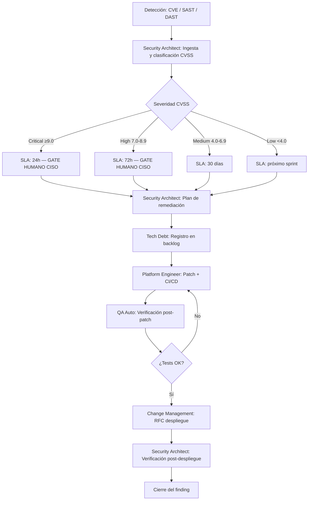

# Security Patch Management

---

## 🎯 Objetivo

Garantizar que todas las vulnerabilidades de seguridad detectadas en el stack APB (CVEs en dependencias, hallazgos SAST, resultados DAST) siguen un proceso estructurado con trazabilidad completa: desde la detección hasta la verificación post-patch. Las vulnerabilidades Critical y High bloquean el pipeline CI/CD hasta resolución o autorización explícita del CISO.

## 📊 Diagrama de Flujo



## 🎭 Agentes Participantes

| Orden | Agente | Rol | Skills Utilizadas |
|-------|--------|-----|-------------------|
| 1 | Security Architect | Clasificación y plan | apb-qa-security-v1.0 (planificado), apb-sec-threat-model |
| 2 | Tech Debt | Registro en backlog | `prov-jira-software-v1.0` |
| 3 | Platform Engineer | Aplicación del patch | `apb-plat-cicd`, `apb-plat-docker` |
| 4 | QA Automation | Verificación post-patch | apb-qa-unit-v1.0 (planificado), apb-qa-security-v1.0 (planificado) |

## 📋 Fases del Workflow

### Fase 1 — Ingesta y Clasificación
- Agente: Security Architect
- **Fuentes de detección:**
  - OWASP Dependency Check (dependencias con CVE en CI/CD)
  - SonarQube SAST (hallazgos de código estático)
  - OWASP ZAP DAST (hallazgos de análisis dinámico en staging)
  - Alertas de Microsoft Sentinel (`prov-sentinel-v1.0`)
  - Boletines de seguridad Microsoft/Oracle/Apache
- Clasificar por CVSS v3.1: Critical (≥9.0) / High (7.0-8.9) / Medium (4.0-6.9) / Low (<4.0)
- Identificar componente afectado, vector de ataque, y si es explotable remotamente

### Fase 2 — Priorización y SLA
- **Critical (CVSS ≥9.0):** resolución en ≤24h. Pipeline CI/CD bloqueado. Notificación inmediata al CISO.
- **High (CVSS 7.0-8.9):** resolución en ≤72h. Pipeline CI/CD bloqueado. Notificación al CISO en ≤4h.
- **Medium (CVSS 4.0-6.9):** resolución en ≤30 días. Pipeline no bloqueado pero el finding queda registrado.
- **Low (CVSS <4.0):** resolución en el próximo sprint planificado.

### Fase 3 — Plan de Remediación + Gate CISO ⚠️ GATE HUMANO *(Critical/High)*
- Agente: Security Architect
- Opciones de remediación evaluadas: upgrade de dependencia, patch de código, WAF rule, mitigación temporal
- Si no hay patch disponible: evaluar mitigación técnica (network segmentation, desactivar feature afectada)
- **Gate humano para Critical/High:** el CISO debe aprobar el plan de remediación antes de proceder
- El CISO puede autorizar una excepción temporal con fecha de resolución comprometida (máximo 30 días para High, 7 días para Critical)

### Fase 4 — Registro en Backlog
- Agente: Tech Debt (vía `prov-jira-software-v1.0`)
- Crear issue en Jira Software con: CVE/finding ID, CVSS, componente, plan de remediación, SLA
- Prioridad Jira mapeada a severidad CVSS: Critical → Highest, High → High, Medium → Medium, Low → Low
- Etiquetar con `ia-generado`, `security`, `patch-required`

### Fase 5 — Aplicación del Patch
- Agente: Platform Engineer
- Actualizar dependencia afectada o aplicar patch de código
- Ejecutar pipeline CI/CD completo (tests unitarios + SAST + Dependency Check)
- Si SAST o Dependency Check vuelven a fallar con otro finding → registrar nuevo finding en Fase 1

### Fase 6 — Verificación Post-Patch
- Agente: QA Automation
- Ejecutar suite de tests de regresión (unitarios + integración)
- Re-ejecutar OWASP Dependency Check para confirmar que el CVE está resuelto
- Re-ejecutar SAST para confirmar que el hallazgo de código no persiste
- Si hay DAST pendiente: re-ejecutar en staging para el vector de ataque específico

### Fase 7 — Despliegue en Producción
- Iniciar `apb-wf-change-management-v1.0` con el RFC del patch
- Para Critical/High: Change Emergency o Normal con SLA reducido
- El RFC referencia el finding original para trazabilidad completa

### Fase 8 — Cierre del Finding
- Agente: Security Architect
- Verificación post-despliegue: confirmar que el finding no reaparece en el siguiente scan CI/CD
- Actualizar el ticket Jira con estado Cerrado, fecha de resolución y evidencia de verificación
- Si el finding era un falso positivo: documentar en la lista de exclusiones de SonarQube/Dependency Check con justificación

## 📥 Input Inicial

- Finding de seguridad (CVSS ID, descripción, componente afectado, vector de ataque)
- Fuente del hallazgo (OWASP Dependency Check, SonarQube, OWASP ZAP, Sentinel, boletín externo)
- Entorno afectado (dev/staging/producción)
- Fecha de detección

## 📤 Output Final

- Finding cerrado con resolución verificada en CI/CD
- RFC cerrado (despliegue del patch en producción)
- Registro de auditoría de seguridad actualizado
- Excepciones documentadas con justificación y fecha de expiración

## 🔄 Puntos de Decisión

- **DP1:** ¿Hay patch disponible del proveedor? Si no → evaluar mitigación técnica temporal.
- **DP2:** ¿El CISO autoriza el plan de remediación? Si no → revisión del plan.
- **DP3:** ¿Los tests post-patch pasan? Si no → volver a Fase 5.
- **DP4:** ¿Es un falso positivo? Si sí → documentar y excluir de futuros scans con justificación auditada.

## 🚫 Límites del Workflow

- NO puede marcar un finding como falso positivo sin justificación documentada y aprobación del Security Architect
- NO puede desplegar un patch Critical/High en producción sin RFC aprobado por Change Management
- NO gestiona vulnerabilidades en infraestructura de red (firewalls, switches) — esas van por proceso de Network Security APB
- Las excepciones temporales tienen fecha de expiración obligatoria — no se permiten excepciones indefinidas

## 🔒 Seguridad y Cumplimiento

- OWASP Top 10 2021 — categorías de riesgo de referencia
- ENS RD 311/2022 — medidas de seguridad obligatorias según nivel de clasificación del sistema
- CVSS v3.1 — sistema de puntuación estándar para priorización
- Los CVEs con CVSS ≥7.0 bloquean el pipeline hasta resolución o autorización explícita del CISO
- Trazabilidad completa: finding → remediación → patch → verificación → cierre

## 📝 Ejemplo de Ejecución

```yaml
workflow: apb-wf-security-patch-v1.0
inputs:
  finding_id: "CVE-2024-38819"
  cvss_score: 7.5
  severity: "High"
  component: "org.springframework:spring-webmvc:6.1.0"
  affected_systems:
    - "apb-api-atraques"
    - "apb-api-tributos"
  attack_vector: "Network"
  detection_source: "OWASP Dependency Check"
  detection_date: "2026-06-29"
  pipeline_blocked: true
```

## 🔄 Historial de Cambios

| Versión | Fecha | Autor | Cambio |
|---------|-------|-------|--------|
| 1.0.0 | 2026-06-29 | Arquitectura APB | Creación inicial — Sesión Enriquecimiento C2 |

---
*Documento generado por el APB AI Framework. Requiere revisión humana antes de aprobación.*

---

## Marcado IA obligatorio (POLICY_AI_USAGE §6)

Conforme al [`AI_MARKING_STANDARD`](../context/apb/standards/AI_MARKING_STANDARD.md), todo artefacto generado por este workflow debe incluir marca de origen IA:

- **Documentos Markdown** (plan de remediación, informe de seguridad):
  > ⚠️ **Borrador generado por IA** (APB AI Framework — apb-wf-security-patch-v1.0) — pendiente validación humana. No distribuir sin revisión.
- **Tickets Jira**: label `ia-generado` + footer en descripción.
- **Commits**: prefijo `[ai-gen]` + `Co-Authored-By: APB AI Framework <framework@portdebarcelona.cat>`.
