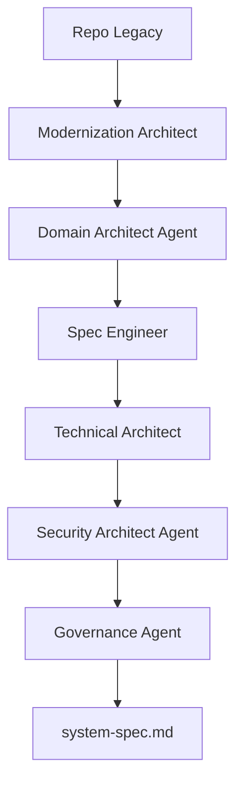

# Spec Generation from Legacy

---

## 🎯 Objetivo

Generar system-spec.md completo desde código legacy existente, incluyendo modelado de dominio, contratos API, y backlog de modernización.

## 📊 Diagrama de Flujo



## 🎭 Agentes Participantes

| Orden | Agente | Rol | Skills Utilizadas |
|-------|--------|-----|-------------------|
| 1 | Modernization Architect | Análisis de código legacy | `apb-disc-reverse-code`, `apb-dev-code-base` |
| 2 | Domain Architect Agent | Modelado DDD desde código | `apb-arch-ddd`, `apb-disc-ddd-legacy` |
| 3 | Spec Engineer | Generación de especificaciones | `apb-disc-spec-gen`, `apb-disc-backlog` |
| 4 | Technical Architect | Diseño técnico de modernización | `apb-arch-decompose`, `apb-arch-tech-plan` |
| 5 | Security Architect Agent | Seguridad en especificaciones | `apb-sec-threat-model`, `apb-sec-owasp` |
| 6 | Governance Agent | Validación de gobierno | `apb-gov-compliance`, `apb-gov-standards` |

## 📡 Contratos de Output Inter-Agente

| Agente Origen | Agente Destino | Artefacto entregado | Formato |
|---------------|----------------|---------------------|---------|
| `apb-agent-modernization-v1.0` | `apb-agent-domain-architect-v1.0` | Informe de fase con hallazgos y recomendaciones | Markdown |
| `apb-agent-domain-architect-v1.0` | `apb-agent-spec-engineer-v1.0` | Informe de fase con hallazgos y recomendaciones | Markdown |
| `apb-agent-spec-engineer-v1.0` | `apb-agent-technical-architect-v1.0` | Informe de fase con hallazgos y recomendaciones | Markdown |
| `apb-agent-technical-architect-v1.0` | `apb-agent-security-architect-v1.0` | Informe de fase con hallazgos y recomendaciones | Markdown |
| `apb-agent-security-architect-v1.0` | `apb-agent-governance-v1.0` | Informe de fase con hallazgos y recomendaciones | Markdown |

## 📋 Fases del Workflow

### Fase 1: Análisis de Código Legacy
- Ingeniería inversa desde código fuente
- Análisis de dependencias y deuda técnica
- Identificación de funcionalidades y flujos

### Fase 2: Modelado de Dominio
- Extracción de bounded contexts desde código
- Identificación de agregados y entidades
- Generación de context map

### Fase 3: Generación de Especificaciones
- Creación de `system-spec.md` desde análisis
- Generación de backlog ágil de modernización
- Estimación COSMIC Function Points

### Fase 4: Diseño Técnico de Modernización
- Propuesta de descomposición en microservicios
- Diseño de contratos API modernos
- Plan técnico de migración

### Fase 5: Seguridad
- Threat modeling de arquitectura propuesta
- Validación ENS/OWASP en especificaciones
- Identificación de riesgos de modernización

### Fase 6: Validación de Gobierno
- Validación de cumplimiento con estándares
- Verificación de completitud de especificaciones
- Aprobación del documento generado

## 📥 Input Inicial

- Repositorio de código legacy completo
- Base de datos legacy (esquema)
- Documentación existente (si disponible)
- Objetivos de modernización
- Stack tecnológico objetivo

## 📤 Output Final

- Especificación completa `system-spec-from-legacy.md`
- Modelo de dominio DDD (`ddd-model.md`)
- Backlog ágil de modernización
- Plan técnico de migración
- Análisis de riesgos de modernización
- ADRs de decisiones de modernización

## 🔄 Puntos de Decisión

- **DP1:** ¿El código legacy es suficientemente comprensible? Si no, requiere entrevistas.
- **DP2:** ¿Los bounded contexts extraídos son viables? Si no, iterar con Domain Architect.
- **DP3:** ¿Las especificaciones son completas y trazables? Validar con Governance.
- **DP4:** ¿El diseño técnico pasa threat modeling? Si no, iterar con Security Architect.
- **DP5:** ¿Pasa validación de gobierno? Si no, corregir no-conformidades.

## 🚫 Límites y Escapes

- NO puede modificar código legacy directamente
- NO puede ignorar deuda técnica crítica identificada
- Las especificaciones son propuestas que requieren validación humana
- Requiere aprobación de Governance Agent

## 🔒 Seguridad y Cumplimiento

- Anonimización de datos de producción
- No exposición de vulnerabilidades legacy
- Uso de Azure Key Vault para credenciales
- Auditoría de decisiones de modernización
- Trazabilidad completa

## 🚨 Manejo de Fallos

> Documentar para cada fase qué ocurre si falla, si es bloqueante y quién decide la acción de recuperación.

| Fase | Fallo posible | ¿Bloqueante? | Acción del agente | Decisor |
|------|---------------|-------------|-------------------|---------|
| Fase 1: Análisis de Código Legacy | Error técnico o datos insuficientes | Según severidad | Notificar al operador y documentar el estado alcanzado | Humano |
| Fase 2: Modelado de Dominio | Error técnico o datos insuficientes | Según severidad | Notificar al operador y documentar el estado alcanzado | Humano |
| Fase 3: Generación de Especificaciones | Error técnico o datos insuficientes | Según severidad | Notificar al operador y documentar el estado alcanzado | Humano |
| Fase 4: Diseño Técnico de Modernización | Error técnico o datos insuficientes | Según severidad | Notificar al operador y documentar el estado alcanzado | Humano |
| Fase 5: Seguridad | Error técnico o datos insuficientes | Según severidad | Notificar al operador y documentar el estado alcanzado | Humano |
| Fase 6: Validación de Gobierno | Error técnico o datos insuficientes | Según severidad | Notificar al operador y documentar el estado alcanzado | Humano |

> **Principio general:** ante cualquier fallo no contemplado, el workflow se detiene, conserva el estado alcanzado y notifica al responsable humano con el contexto completo. Nunca continúa asumiendo que el fallo se resolverá solo.

## 📝 Ejemplo de Ejecución

```yaml
workflow: apb-wf-spec-from-legacy-v1.0
inputs:
  workflow: "apb-wf-spec-from-legacy-v1.0"
  inputs:
    legacy_repo: "/repos/legacy-system"
    legacy_database:
      connection_string: "ref:akv/legacy-db-conn"
      schema_only: true
    modernization_goals:
      - "Migrar a .NET 8"
      - "Descomponer en microservicios"
      - "Cloud-ready en Azure"
    target_stack:
      - ".NET 8"
      - "Azure Service Bus"
      - "Azure SQL"
    output_format: "spec-from-legacy-package"
```

## 🔄 Historial de Cambios

| Versión | Fecha | Autor | Cambio |
|---------|-------|-------|--------|
| 1.0.0 | 2026-06-21 | Arquitectura APB | Creación inicial |

---
*Documento generado por el APB AI Framework. Requiere revisión humana antes de aprobación.*
