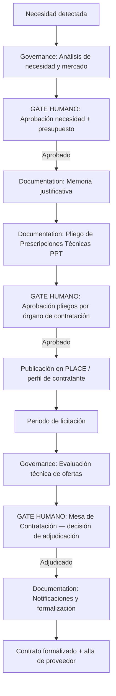

# Vendor Procurement LCSP

---

## 🎯 Objetivo

Apoyar el proceso de contratación pública de APB conforme a la Ley de Contratos del Sector Público (LCSP — Ley 9/2017). El workflow asiste en la preparación de la documentación técnica (memoria justificativa, pliego de prescripciones técnicas, criterios de evaluación) y en la evaluación técnica de las ofertas recibidas. **Las decisiones de adjudicación y formalización son siempre humanas** — el workflow no puede adjudicar ni contratar.

> **Aviso de madurez:** este workflow debe validarse en uso real con el Vendor Manager Agent antes de uso en producción. Implementar tras el piloto del agente con un expediente de contratación real de complejidad baja.

## 📊 Diagrama de Flujo



## 🎭 Agentes Participantes

| Orden | Agente | Rol | Acción |
|-------|--------|-----|--------|
| 1 | Governance | Análisis y evaluación | Análisis de mercado, valoración técnica de ofertas según criterios del pliego |
| 2 | Documentation | Documentación | Memoria justificativa, PPT, notificaciones a licitadores |

## 📋 Fases del Workflow

### Fase 1 — Definición de la Necesidad
- Agente: Governance
- Identificar y describir la necesidad a cubrir con justificación de por qué no puede resolverse con medios propios
- Estimación del valor estimado del contrato (VEC) para determinar el procedimiento aplicable:
  - Contrato menor: ≤15.000€ (servicios/suministros) / ≤40.000€ (obras)
  - Procedimiento simplificado abreviado: ≤35.000€
  - Procedimiento simplificado: ≤100.000€ (servicios/suministros)
  - Procedimiento abierto: resto
- Análisis preliminar de mercado (proveedores conocidos, precios de referencia)

### Fase 2 — Aprobación de Necesidad ⚠️ GATE HUMANO
- La dirección del área responsable aprueba la necesidad y el presupuesto estimado
- Si el VEC supera el umbral de publicación en DOUE: notificarlo para tramitación específica

### Fase 3 — Memoria Justificativa
- Agente: Documentation
- Generar la memoria justificativa conforme al art. 28 LCSP:
  - Justificación de la necesidad
  - Descripción del objeto del contrato
  - Estimación del VEC y metodología de cálculo
  - Procedimiento de licitación propuesto y justificación
  - Criterios de solvencia técnica y económica

### Fase 4 — Pliego de Prescripciones Técnicas (PPT)
- Agente: Documentation
- Elaborar el PPT con:
  - Descripción técnica detallada del objeto del contrato
  - Requisitos técnicos mínimos (solvencia técnica)
  - Criterios de adjudicación técnicos y su ponderación (máx. 51 puntos técnicos si hay criterios económicos)
  - Condiciones de ejecución del contrato
  - Requisitos de entrega y aceptación
- **Gate humano:** el órgano de contratación APB revisa y aprueba el PPT antes de publicar

### Fase 5 — Publicación y Licitación
- Publicación en la Plataforma de Contratación del Sector Público (PLACE) y perfil de contratante APB
- El agente no gestiona la publicación — la realiza el equipo de contratación APB mediante los sistemas oficiales
- Periodo de licitación según LCSP (mínimo 15 días hábiles para procedimiento abierto simplificado)

### Fase 6 — Evaluación Técnica de Ofertas
- Agente: Governance
- Para cada oferta recibida: valorar los criterios técnicos según la metodología definida en el PPT
- Generar informe de evaluación técnica con puntuación justificada por criterio y oferta
- **LÍMITE:** el agente NO adjudica — genera el informe técnico de soporte para la Mesa de Contratación

### Fase 7 — Decisión de Adjudicación ⚠️ GATE HUMANO (exclusivo)
- La Mesa de Contratación APB toma la decisión de adjudicación
- El agente no participa en esta fase — es exclusivamente humana por imperativo legal (LCSP)
- El acuerdo de adjudicación queda registrado en el expediente

### Fase 8 — Notificaciones y Formalización
- Agente: Documentation
- Generar las notificaciones a todos los licitadores (adjudicatario y no adjudicatarios)
- Apoyar la elaboración de la documentación de formalización del contrato
- **Gate humano:** firma del contrato por el representante legal de APB (siempre humano)

## 📥 Input Inicial

- Descripción de la necesidad
- Área solicitante y responsable
- Estimación del presupuesto disponible
- Plazo de necesidad (fecha en la que se necesita el servicio/suministro)
- Proveedores conocidos del mercado (si existen)

## 📤 Output Final

- Memoria justificativa (`memoria-justificativa-EXP-YYYY-NNNN.md`)
- Pliego de Prescripciones Técnicas (`ppt-EXP-YYYY-NNNN.md`)
- Informe de evaluación técnica de ofertas
- Notificaciones a licitadores

## 🔄 Puntos de Decisión

- **DP1:** ¿El VEC es ≤15.000€? Si sí → contrato menor sin licitación formal (tramitación directa).
- **DP2:** ¿El VEC supera el umbral DOUE (>221.000€ para servicios)? Si sí → publicación en DOUE requerida.
- **DP3:** ¿Hay oferta técnicamente incompleta o que no cumple los mínimos? → Excluir de la evaluación (decisión humana de la Mesa).

## 🚫 Límites del Workflow

- NO puede adjudicar contratos — la adjudicación es siempre una decisión de la Mesa de Contratación humana
- NO puede firmar contratos — la formalización requiere firma electrónica del representante legal APB
- NO accede a datos económicos de las ofertas — la valoración económica la realiza el equipo de contratación
- NO reemplaza al equipo jurídico de contratación — apoya la elaboración técnica, no la tramitación administrativa
- Las exclusiones de licitadores por causas de prohibición de contratar requieren verificación en ROLECE (manual)

## 🔒 Seguridad y Cumplimiento

- LCSP — Ley 9/2017, de Contratos del Sector Público
- RD 1098/2001 — Reglamento General de Contratos de las Administraciones Públicas
- Los documentos de los expedientes de contratación tienen carácter confidencial hasta la publicación
- Los datos de los licitadores (ofertas, precios) son confidenciales — no incluir en artefactos del repositorio
- El expediente completo se custodia en los sistemas oficiales de APB (no en este repositorio)

## 🚨 Manejo de Fallos

> Documentar para cada fase qué ocurre si falla, si es bloqueante y quién decide la acción de recuperación.

| Fase | Fallo posible | ¿Bloqueante? | Acción del agente | Decisor |
|------|---------------|-------------|-------------------|---------|
| Fase 1 — Definición de la Necesidad | Error técnico o datos insuficientes | Según severidad | Notificar al operador y documentar el estado alcanzado | Humano |
| Fase 2 — Aprobación de Necesidad ⚠️ GATE HUMANO | Error técnico o datos insuficientes | Según severidad | Notificar al operador y documentar el estado alcanzado | Humano |
| Fase 3 — Memoria Justificativa | Error técnico o datos insuficientes | Según severidad | Notificar al operador y documentar el estado alcanzado | Humano |
| Fase 4 — Pliego de Prescripciones Técnicas (PPT) | Error técnico o datos insuficientes | Según severidad | Notificar al operador y documentar el estado alcanzado | Humano |
| Fase 5 — Publicación y Licitación | Error técnico o datos insuficientes | Según severidad | Notificar al operador y documentar el estado alcanzado | Humano |
| Fase 6 — Evaluación Técnica de Ofertas | Error técnico o datos insuficientes | Según severidad | Notificar al operador y documentar el estado alcanzado | Humano |
| Fase 7 — Decisión de Adjudicación ⚠️ GATE HUMANO (exclusivo) | Error técnico o datos insuficientes | Según severidad | Notificar al operador y documentar el estado alcanzado | Humano |
| Fase 8 — Notificaciones y Formalización | Error técnico o datos insuficientes | Según severidad | Notificar al operador y documentar el estado alcanzado | Humano |

> **Principio general:** ante cualquier fallo no contemplado, el workflow se detiene, conserva el estado alcanzado y notifica al responsable humano con el contexto completo. Nunca continúa asumiendo que el fallo se resolverá solo.

## 📝 Ejemplo de Ejecución

```yaml
workflow: apb-wf-vendor-procurement-v1.0
inputs:
  need_description: "Servicio de mantenimiento correctivo y evolutivo de la aplicación GISPEM durante 2 años"
  requesting_area: "Operaciones Portuarias"
  responsible_person: "responsable-operaciones@portdebarcelona.cat"
  estimated_budget_eur: 180000
  required_by: "2026-10-01"
  contract_duration_months: 24
  known_providers:
    - "Proveedor actual del sistema GISPEM"
  procedure_type: "abierto_simplificado"
```

## 🔄 Historial de Cambios

| Versión | Fecha | Autor | Cambio |
|---------|-------|-------|--------|
| 1.0.0 | 2026-06-29 | Arquitectura APB | Creación inicial — Sesión Enriquecimiento C2 |

---
*Documento generado por el APB AI Framework. Requiere revisión humana antes de aprobación.*

---

## Marcado IA obligatorio (POLICY_AI_USAGE §6)

Conforme al [`AI_MARKING_STANDARD`](../context/apb/standards/AI_MARKING_STANDARD.md), todo artefacto generado por este workflow debe incluir marca de origen IA:

- **Documentos Markdown** (memoria justificativa, PPT, informe de evaluación):
  > ⚠️ **Borrador generado por IA** (APB AI Framework — apb-wf-vendor-procurement-v1.0) — pendiente revisión jurídica y aprobación por el órgano de contratación. No usar en expediente sin revisión.
- **Commits**: prefijo `[ai-gen]` + `Co-Authored-By: APB AI Framework <framework@portdebarcelona.cat>`.
